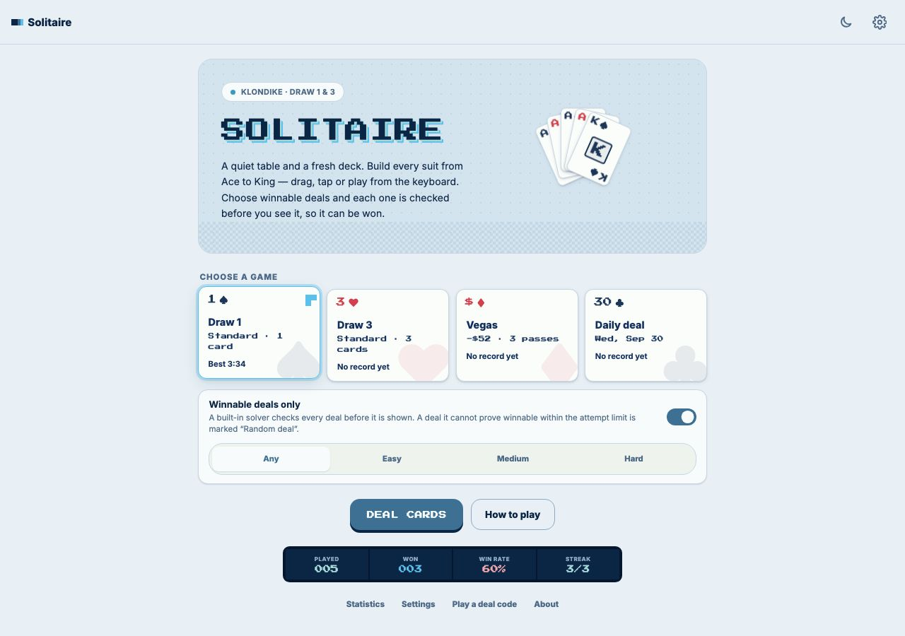
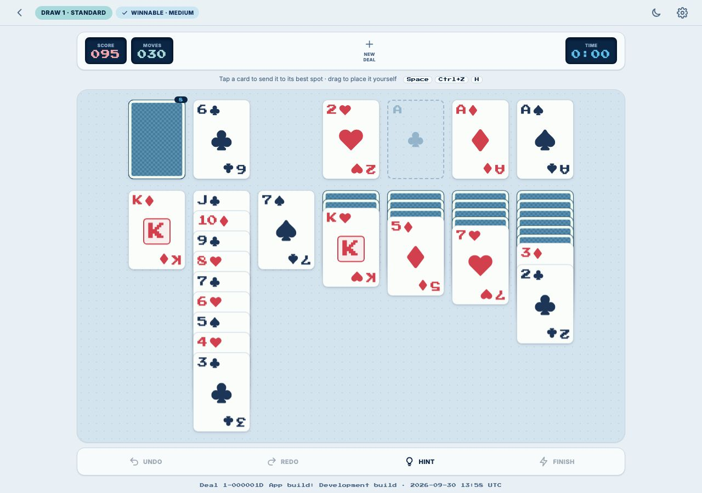
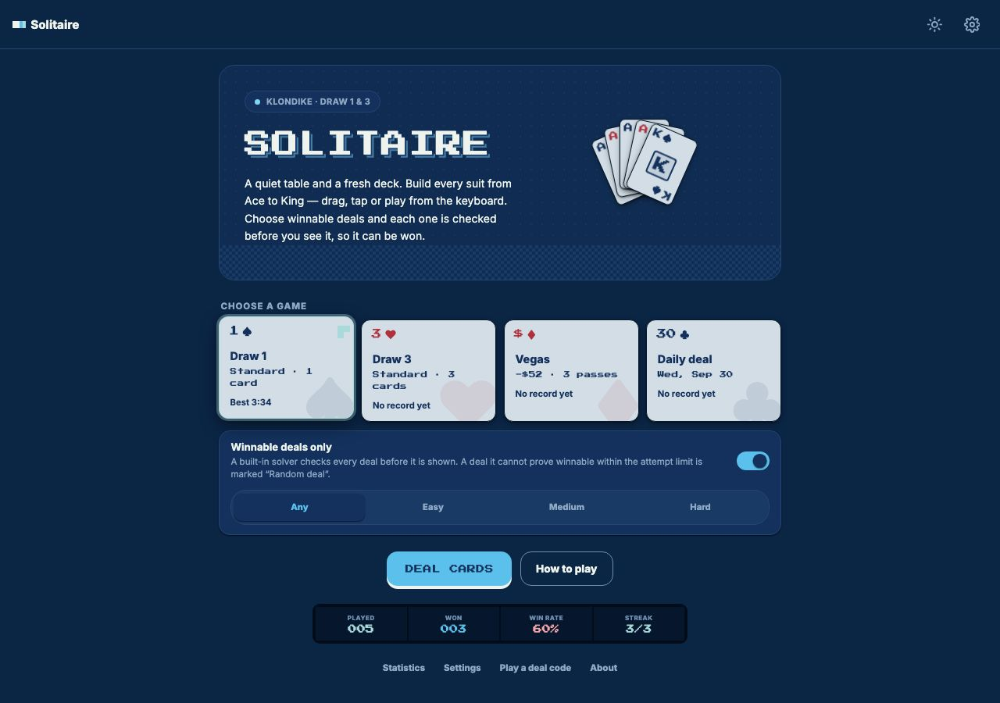
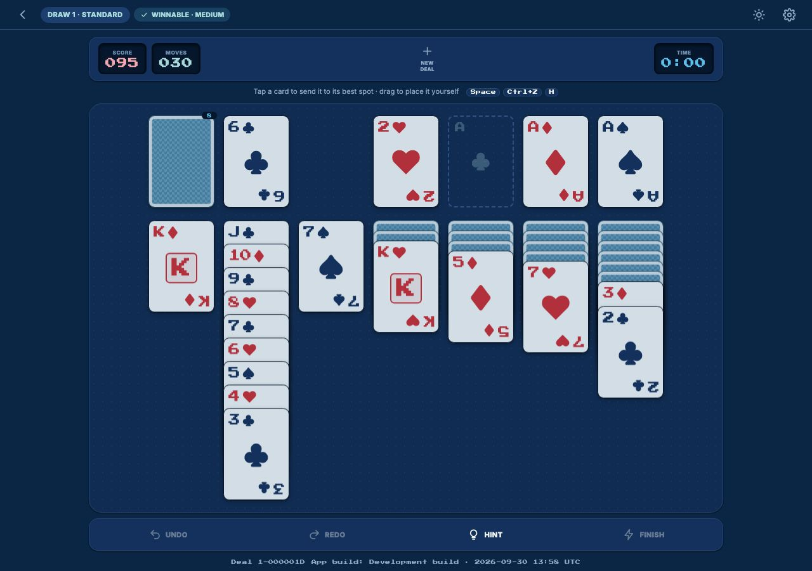
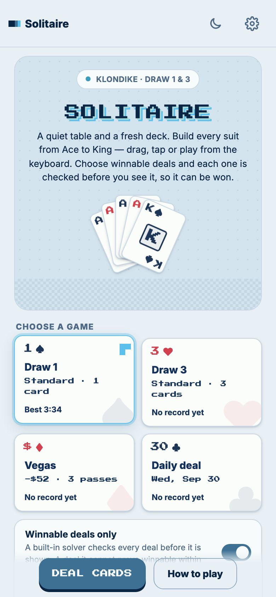
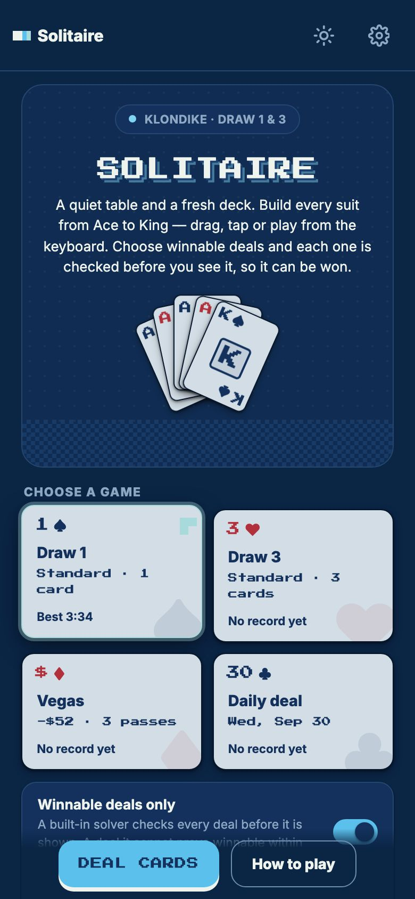
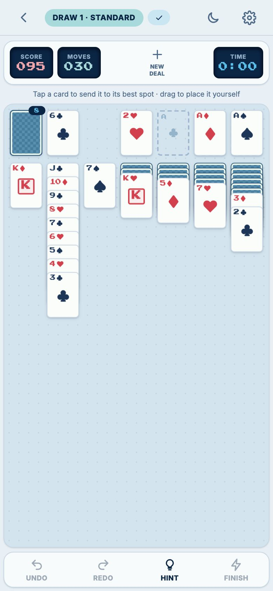
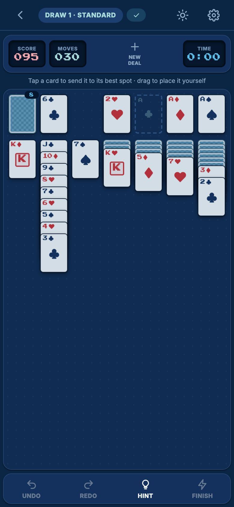

# Klondike Solitaire

A calm, retro-styled Klondike Solitaire that runs in the browser, works offline and installs as an app. It is a static
single-page app (Vite, React, TypeScript, Redux Toolkit): no backend, no API and no account. Game state, preferences and
statistics stay in your browser's `localStorage` (record `solitaire.local-state`).

**Play it: <https://sanyokkua.github.io/solitaire/>**

|                                    Home                                    |                                         Game                                          |
| :------------------------------------------------------------------------: | :-----------------------------------------------------------------------------------: |
|  |  |
|    |    |

On a phone:

|  |  |  |  |
| :---------------------------------------------------------------------: | :-------------------------------------------------------------------: | :--------------------------------------------------------------------------------: | :------------------------------------------------------------------------------: |

## Game

- **Modes.** Draw 1, Draw 3, Vegas (a $52 bank, three passes through the deck) and a Daily deal that is the same for everyone on a given UTC date.
- **Winnable, graded deals.** With "Winnable deals only" on, a built-in solver proves every Draw 1, Draw 3 and Vegas deal winnable before you see it, and grades it Easy, Medium or Hard by how forgiving it is; the Difficulty control asks for a grade. Deals are kept ready in the background, so most start at once, and a slow search shows a "Shuffling cards before the game…" screen.
  See [winnability](docs/reference/winnability.md).
- **Play your way.** Tap, drag or keyboard, all equal. Undo, redo, hint, finish and pause.
- **Shareable.** Every deal is deterministic from a seed and can be shared as a deal code.
- **Offline and installable.** Works offline after the first visit and can be installed from the browser.
- **Look.** Light, dark and system themes, a four-colour deck, night cards and four card backs, with reduced motion respected.
- **Languages.** English and Ukrainian.
- **Accessible.** Accessible names, live announcements, focus management, 4.5:1 contrast and touch targets of at least 44 px.
- **Statistics.** Games played and won, best times and scores, and the Daily streak, per mode.

The rules as implemented are in [game rules](docs/reference/game-rules.md), the shortcuts in
[keyboard and controls](docs/reference/keyboard-and-controls.md).

## Requirements

- Node.js 22.22.2 or newer
- npm (uses the committed `package-lock.json`)

## Run locally

```sh
npm ci
npm run dev
```

Open <http://localhost:5173/solitaire/>.

## Build

```sh
npm run build      # type-check, then build into dist/
npm run preview    # serve the production build
```

## Check

```sh
npm run validate   # format, lint, typecheck, unit/component tests, build, artifact check
npx playwright install --with-deps chromium firefox webkit   # once, for the browser suite
npm run e2e        # Playwright end-to-end suite
```

All scripts are listed in [docs/reference/scripts.md](docs/reference/scripts.md).

## Documentation

| Document                                                                       | Contents                                             |
| ------------------------------------------------------------------------------ | ---------------------------------------------------- |
| [docs/README.md](docs/README.md)                                               | Index and reading order                              |
| [docs/architecture/overview.md](docs/architecture/overview.md)                 | Layers, dependency rules, how the pieces fit         |
| [docs/reference/game-rules.md](docs/reference/game-rules.md)                   | The rules, modes, scoring and deal codes             |
| [docs/reference/winnability.md](docs/reference/winnability.md)                 | Winnable and graded deals, the solver, the deal pool |
| [docs/development/project-structure.md](docs/development/project-structure.md) | Where things live and how to navigate the repository |
| [docs/development/workflow.md](docs/development/workflow.md)                   | OpenSpec workflow, branches, commits, hooks          |
| [docs/development/testing.md](docs/development/testing.md)                     | Test layers, guards and how to run them              |
| [docs/reference/traceability.md](docs/reference/traceability.md)               | Which tests prove which requirement                  |
| [AGENTS.md](AGENTS.md)                                                         | Conventions for AI coding agents                     |

## Contributing

Features and behaviour changes are introduced through [OpenSpec](openspec/): a change is proposed,
implemented task by task, then archived into `openspec/specs/`. See
[docs/development/workflow.md](docs/development/workflow.md). Documentation is updated in the same change.

## License

[MIT](LICENSE). The bundled Inter and Press Start 2P fonts are under the SIL Open Font License 1.1;
sources are in [src/assets/fonts/README.md](src/assets/fonts/README.md).
