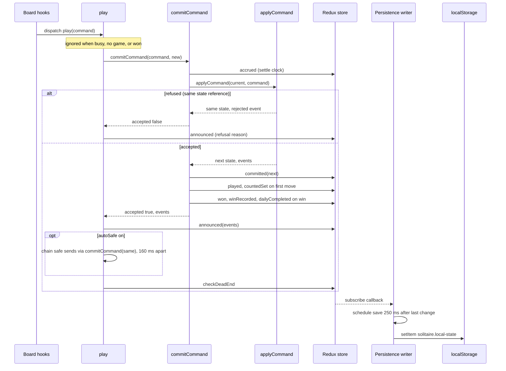
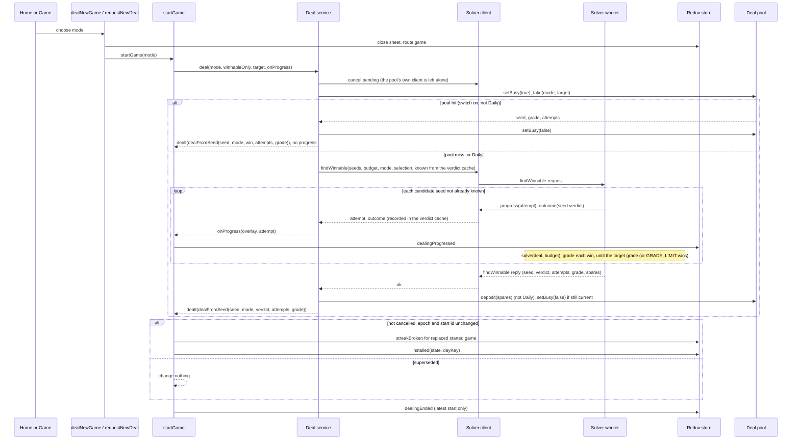
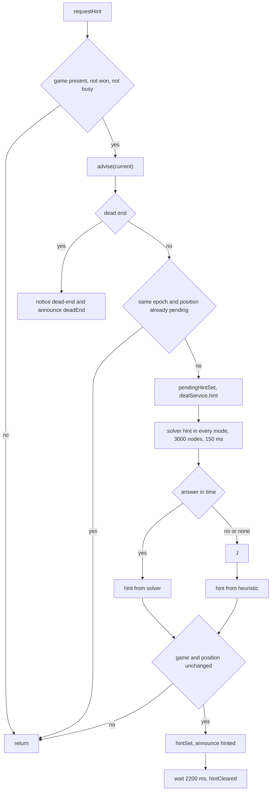
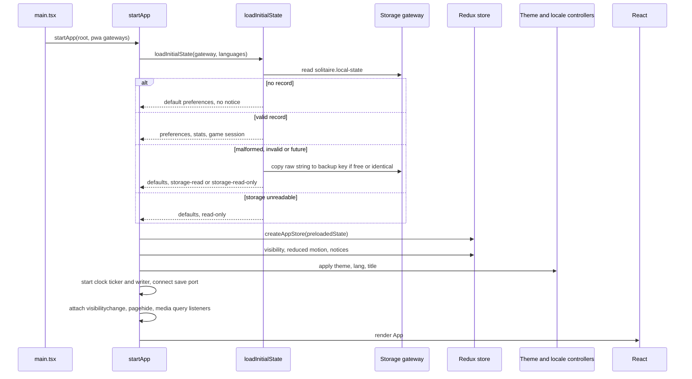
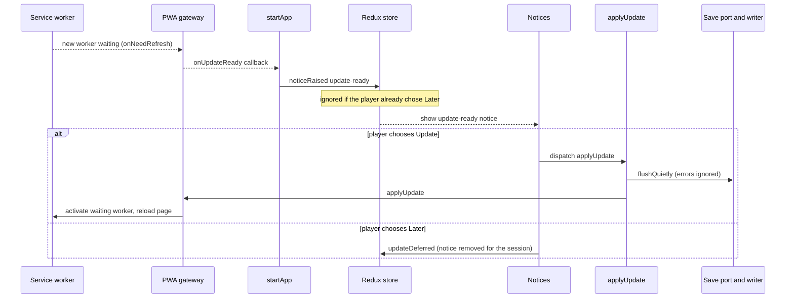

# Data flows

Diagrams of the main runtime paths. Names in the diagrams are the modules described in
[state-and-persistence.md](state-and-persistence.md) and [domain-and-solver.md](domain-and-solver.md).

## Move: tap or drag to saved game

Tap, drag and keyboard all end in the same thunk. The board hooks (`src/ui/board/useBoardActions.ts`,
`src/ui/board/useBoardPointer.ts`, `src/ui/board/useGameShortcuts.ts`) dispatch
`src/features/game/gameThunks.ts#play` with a `Command`; a smart tap first asks
`src/domain/smartTap.ts#bestTarget` for the destination, and a drop uses the legal target with the largest overlap.
The UI never applies rules itself.

Notes:

- A refusal changes nothing but the clock settlement. A `pass-limit` refusal also raises the `no-redeals` notice.
- The `interaction` slice clears the selection and hint on `committed`, `replaced`, `undone`, `redone`, `installed`
  and `cleared`.
- Time-only changes are saved at most every 5 s; see the writer notes in
  [state-and-persistence.md](state-and-persistence.md#persistence).

## New deal

`src/features/game/sessionThunks.ts#startGame` reads `winnableOnly` and the Difficulty (sent as `target`, the grade
wanted), asks the deal service, and installs the result. With the switch on, Draw 1, Draw 3 and Vegas are served at
once from the graded-spare pool when it holds a deal of the target grade, and otherwise use the player's worker, at the
mode's budget; Daily always uses the worker (always for `any`) and never the pool; with the switch off the request is
dealt at once on the calling thread.

Notes:

- `overlay` in the progress report becomes true after 160 ms, which is when the dealing overlay shows. A pooled deal
  reports no progress and starts no overlay timer.
- A new `deal` cancels the pending one and terminates a busy player worker; the older start delivers nothing. It never
  cancels the pool's fill, which runs on a worker of its own.
- The pool starts no fill while a request that may search is pending; a superseded search does not end the pause of the
  newer one. `prefetch(choice)` and `pause()` set what the pool fills and when (the controller that calls them lands
  with task 9.6).
- Every search sends the verdict cache's entries for its seeds as `known`, so a repeated Daily request searches none of
  its candidates again.
- If the worker fails, the first candidate seed is dealt unverified and ungraded (`random`, 1 attempt, no grade), in every mode.
- A requested grade that is not found within `GRADE_LIMIT` proven candidates deals the closest one, labelled with its own grade.
- With the switch off, every mode skips the worker: one `cryptoSeed`, `dealFromSeed`, `installed`; the Difficulty is ignored.
- `restart` and `playDealCode` also install directly with `dealFromSeed`, without the service.

## Hint

`src/features/interaction/interactionThunks.ts#requestHint`. A hint costs no score or move and never changes the game.

A pending deal makes the solver client answer `busy`, so the heuristic answers.

## Startup and restore

`src/main.tsx` calls `src/app/lifecycle.tsx#startApp`.

A restored game arrives with `route` still `home`; the Continue action (`continueGame`) shows the Game screen only
when the game is started and still playing. The clock does not run until the Game screen is shown.

## PWA update and install

`src/main.tsx` builds two gateways and passes them to `startApp`.

- Update: `src/pwa/deferredGateway.ts#createDeferredPwaGateway` exists immediately but calls
  `src/pwa/registerPwa.ts#registerPwa` only after `load` (or at once if the document is complete), so registration
  never delays the first render. `src/pwa/pwaGateway.ts#createPwaGateway` wraps vite-plugin-pwa's `registerSW`
  (`registerType: 'prompt'`): `onNeedRefresh` notifies listeners, and `applyUpdate` calls `updateSW(true)`, which
  activates the waiting worker and reloads the page.
- Install: `src/pwa/installGateway.ts#createInstallGateway` listens from the start for `beforeinstallprompt` (kept
  and default-prevented) and `appinstalled`, and reports availability.

The update-ready text warns that the current game will not be kept when persistence is read-only or the last save
failed at the moment the notice appeared (`src/ui/components/Notices.tsx`). Update applies in every case.

Install: the gateway reports availability, `startApp` dispatches `installableChanged`, the Home Install link shows,
and `src/app/pwaThunks.ts#installApp` prompts and then sets `installable` to false whatever the choice.

Without gateways (tests, dev) `ThunkExtra.pwa` is `inertPwaPort`: no update notice and no install offer.

## Related

- [Domain, solver and deal service](domain-and-solver.md)
- [State and persistence](state-and-persistence.md)
