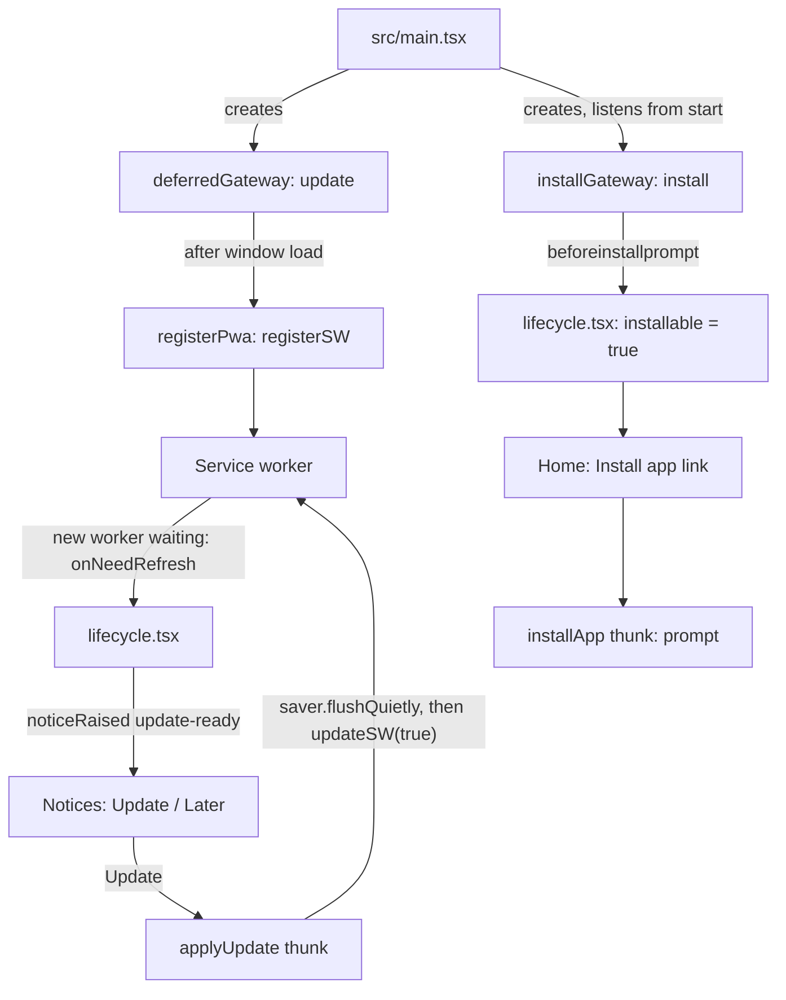

# Internationalisation and PWA

Two small layers that sit beside the game code: `src/i18n` (translations) and `src/pwa` (service worker and install).
Both import nothing from `src/app`, `src/features` or `src/ui`; `tests/unit/repo/layerBoundaries.test.ts` enforces that,
and an ESLint override covers `src/i18n`. Module-level notes: [`src/i18n/README.md`](../../src/i18n/README.md) and
[`src/pwa/README.md`](../../src/pwa/README.md).

## Internationalisation

### Parts

| Module                                                | Job                                                                                                                                                                              |
| ----------------------------------------------------- | -------------------------------------------------------------------------------------------------------------------------------------------------------------------------------- |
| `src/i18n/locales/en.ts#en`                           | English catalog, `as const satisfies Catalog`. `MessageKey = keyof typeof en` is the typed source of every key.                                                                  |
| `src/i18n/locales/uk.ts#uk`                           | Ukrainian catalog, typed `Record<MessageKey, Message>`, so a missing key fails `typecheck`.                                                                                      |
| `src/i18n/catalog.ts#CATALOGS`                        | The language registry: one entry per language, `{ name, catalog }`. Order is the order Settings lists them.                                                                      |
| `src/i18n/catalog.ts#SUPPORTED_LOCALES`               | Registry keys. `Locale` is `keyof typeof CATALOGS`.                                                                                                                              |
| `src/i18n/translate.ts#createTranslator`              | `createTranslator(locale, catalog, fallback)` returns `t(key, params?)`.                                                                                                         |
| `src/i18n/translate.ts#formatDate`                    | Formats a UTC calendar date in the locale's words, independent of the machine time zone.                                                                                         |
| `src/i18n/useTranslate.ts#useTranslate`               | React hook: reads `state.preferences.locale`, returns `t` memoised on the locale. The only React-aware i18n module.                                                              |
| `src/i18n/localeController.ts#createLocaleController` | Sets `<html lang>` and `document.title` (the `app.title` message) on start and on each locale change. `src/app/lifecycle.tsx` creates and disposes it with the theme controller. |

### How the translator behaves

- A message is a string with `{name}` placeholders, or a plural object keyed by CLDR category (`zero`, `one`, `two`,
  `few`, `many`, `other`).
- For a counted message, the form is chosen with `Intl.PluralRules(locale)` from `params.count`, falling back to
  `other`. Placeholders are then filled from `params`; an unknown placeholder is left as written.
- A key missing from the active catalog falls back to the English catalog. A key in neither is returned unchanged; the
  translator never throws.
- Descriptors in state (for example the announcement log) carry no text. Words are produced at render time, so a locale
  change updates open sheets and raised notices in place.

### Where the locale comes from

- First run: `src/features/preferences/locale.ts#resolveLocale` picks the first browser-preferred language whose primary
  subtag is registered (`uk-UA` selects `uk`), otherwise English. A newly registered language therefore becomes the
  first-run language for browsers that prefer it.
- After that: the `locale` preference, changed from the Settings Language control.
- Saved data: `src/features/persistence/recordCodec.ts` checks the stored locale against `SUPPORTED_LOCALES`. A locale
  not in the registry is rejected when a saved record is decoded.

### How to add a language

1. Create `src/i18n/locales/<code>.ts` exporting a catalog typed `Record<MessageKey, Message>`. Import `MessageKey` and
   the `Message` type from `./en` and `../translate`, as `uk.ts` does. A missing key fails `typecheck`
   (`tests/unit/i18n/catalogCompleteness.test-d.ts`).
2. Give plural messages the categories of `Intl.PluralRules('<code>')`. Ukrainian, for example, uses `one`, `few`,
   `many`, `other`. `tests/unit/i18n/catalog.test.ts` fails on a category the language lacks.
3. Register it in `CATALOGS` in `src/i18n/catalog.ts` with the language's own display name, for example
   `pl: { name: 'Polski', catalog: pl }`.
4. Nothing else changes: `Locale` and `SUPPORTED_LOCALES` derive from the registry, Settings renders one option per
   registry entry, and the stored-locale check follows it.
5. Run `rtk npm run validate`. `catalog.test.ts` checks that every registered catalog has every English key, no empty
   messages, and valid plural categories.
6. Check layout: the device-fit suite runs Ukrainian, and a pseudo-locale pass (text 30% longer) guards against
   clipping. See [testing](../development/testing.md). Whether a new language needs its own device-fit run: TODO: confirm.

Adding a key: add it to `en.ts` first (it defines `MessageKey`), then to every other catalog. `tests/component/pseudoLocale.test.tsx`
fails if any UI text bypasses the catalogs.

## PWA

The app is a static site that works offline after the first visit and can be installed. There is no runtime network
dependency, and no third-party hosts (`scripts/validate-artifact.mjs` checks this on the build).

### Build configuration

- Manifest: a hand-written `public/manifest.webmanifest` (`name` and `short_name` "Solitaire", `display` `standalone`,
  `start_url` and `scope` `/solitaire/`, colours `#0b2545`, icons 192, 512 and maskable 512 in `public/icons/`). The
  plugin's own manifest generation is off (`manifest: false` in `vite.config.ts`). `index.html` links the manifest, the
  favicon and the Apple touch icon.
- Plugin: `vite-plugin-pwa` in `vite.config.ts` with `registerType: 'prompt'` (a new version waits until the player
  chooses to update), `injectRegister: false` (registration is done by our code, not injected), and
  `devOptions.enabled: false` (no service worker under `npm run dev`).
- Workbox: precaches `**/*.{js,css,html,woff2,ttf,png,svg,webmanifest}`, `navigateFallback: 'index.html'`,
  `cleanupOutdatedCaches: true`. No runtime caching (`tests/unit/repo/configContract.test.ts` asserts this). The solver
  worker chunk is precached and `validate-artifact` fails if it is not.
- `tests/unit/repo/manifest.test.ts` and `tests/unit/repo/icons.test.ts` check the manifest and the generated icons.
  Icons come from `scripts/generate-icons.mjs`.
- Icons: the mark is a card fan, a checkered sky/navy card back behind a white card face showing a pixel "A" and a
  spade, on the `#0b2545` background. `scripts/generate-icons.mjs` holds one list of rectangles on a 24 x 24 cell grid
  and renders it twice: `public/favicon.svg` (`<rect>`s, `viewBox="0 0 24 24"`, `crispEdges`) and the PNGs
  `icon-192`, `icon-512`, `apple-touch-icon` (180 px, linked from `index.html`) and `icon-maskable-512`. Each PNG uses
  an integer scale, centred, with navy padding; the maskable icon uses the largest scale whose mark stays inside the
  centred circle of 80 % of the icon (the W3C safe zone). `icons.test.ts` checks every output byte for byte against a
  fresh render, the sizes, the safe zone and that the light card face is present.

### Runtime flow

- `src/main.tsx` is the only place that builds the real gateways and passes them to `startApp` as `deps.pwa`. Without
  them (tests, dev) `startApp` uses an inert port (`src/app/thunkExtra.ts#inertPwaPort`) and no service worker starts.
- Deferred registration: `src/pwa/deferredGateway.ts#createDeferredPwaGateway` returns an update gateway at once and
  calls `register` only on window `load` (or immediately if the document is already `complete`), so registration never
  delays the first render.
- `src/pwa/registerPwa.ts#registerPwa` is the only importer of `virtual:pwa-register`; `src/pwa/pwaGateway.ts#createPwaGateway`
  wraps `registerSW` into `{ onUpdateReady, applyUpdate }`. `applyUpdate` calls `updateSW(true)`, which activates the
  waiting worker and reloads.
- Update: `src/app/lifecycle.tsx` raises the `update-ready` notice when a worker is waiting. The notice offers Update and
  Later; its text warns that the current game will not be kept when persistence is read-only or the last write failed.
  Update runs `src/app/pwaThunks.ts#applyUpdate`: it flushes the save first, ignores a failing flush, then applies the
  update. Updates never apply on their own.
- Install: `src/pwa/installGateway.ts#createInstallGateway` captures `beforeinstallprompt` (calling `preventDefault`),
  clears it on `appinstalled`, and exposes `onAvailabilityChange(cb)` and `prompt()` (`accepted`, `dismissed` or
  `unavailable`). `lifecycle.tsx` sets `app.installable`; `src/ui/screens/home/HomeLinks.tsx` shows an Install app link
  while it is true; `installApp` shows the prompt and then hides the link whatever the player chose. Which browsers fire
  `beforeinstallprompt`: TODO: confirm (the code only reacts to the event).

### Offline behaviour

After the first online visit the service worker has precached the shell and every emitted script, style, font and icon.
Game state, preferences and statistics are in `localStorage` (a versioned record), so nothing needs the network. The
end-to-end test `tests/e2e/pwa.spec.ts` covers an offline cold start (Home, a Winnable Draw 1 deal, a move, Settings),
an offline reload on Game followed by Continue, and the update flow.

### Service workers in end-to-end tests

`playwright.config.ts` sets `use.serviceWorkers: 'block'` for every spec, so no spec sees caching or an update prompt.
Only `tests/e2e/pwa.spec.ts` opts in (`test.use({ serviceWorkers: 'allow' })`) and it runs in Chromium only. Its update
case runs against a test-owned server, `tests/e2e/support/distServer.ts#startDistServer`, which serves `dist/` under
`/solitaire/` and can change the bytes of `sw.js` on demand, because Playwright's `context.route` never sees a service
worker's update check.

## See also

- [CI and deployment](../development/ci-and-deployment.md) for `validate-artifact` and the base path.
- [Testing](../development/testing.md).
