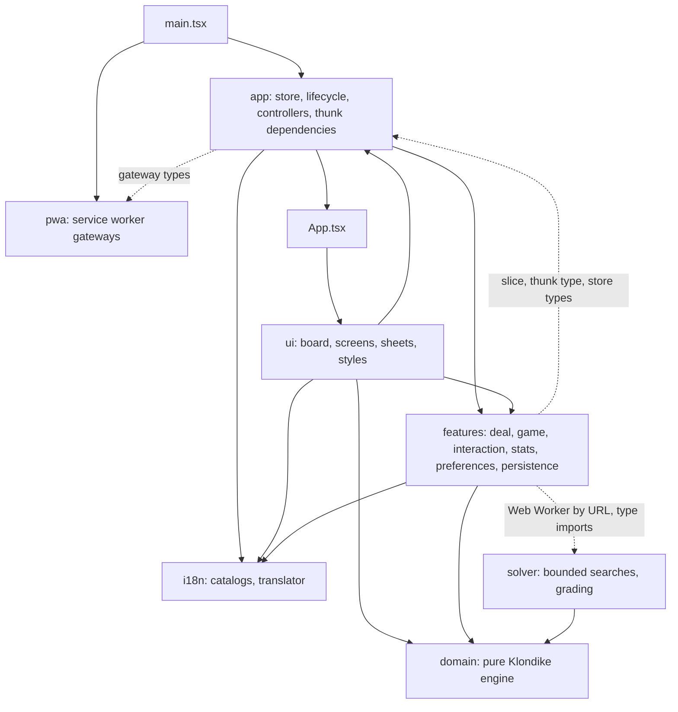

# Architecture overview

Klondike Solitaire is a static single-page app. There is no server: everything runs in the browser, state is kept in
Redux and mirrored to one versioned `localStorage` record, and a service worker makes the built app work offline.

## Layers

The dependency rule: `domain` imports nothing from the other layers, and `solver` imports only `domain`. `i18n` and `pwa`
import nothing from `app`, `features` or `ui`. `features` may use `app` only for its slice, `selectors.ts`, the thunk
type and the store types, reaches `solver` only by worker URL and type-only imports, and never imports `ui`. The
ESLint restrictions and the guard tests listed in [code standards](../development/code-standards.md) enforce these
boundaries.

| Layer      | Role                                                                                                                                                                                                                        | Details                                           |
| ---------- | --------------------------------------------------------------------------------------------------------------------------------------------------------------------------------------------------------------------------- | ------------------------------------------------- |
| `domain`   | Pure rules engine: `applyCommand(state, command)` returns `{ state, events }`.                                                                                                                                              | [domain and solver](domain-and-solver.md)         |
| `solver`   | Pure bounded depth-first search, run in a Web Worker to find winnable deals and hints.                                                                                                                                      | [domain and solver](domain-and-solver.md)         |
| `features` | Redux slices and thunks: game session and history, deal service, stats, preferences, persistence, interaction state. Reaches `app` only through its slice, `app/selectors`, the thunk type and the store types; never `ui`. | [state and persistence](state-and-persistence.md) |
| `app`      | Store composition, injected thunk dependencies, startup (`startApp`), theme and deal pool controllers.                                                                                                                      | [state and persistence](state-and-persistence.md) |
| `ui`       | React components: board, Home and Game screens, sheets, CSS tokens; input handling.                                                                                                                                         | [ui](ui.md)                                       |
| `i18n`     | English and Ukrainian catalogs behind a registry and translator.                                                                                                                                                            | [i18n and pwa](i18n-and-pwa.md)                   |
| `pwa`      | Service-worker registration, update and install gateways.                                                                                                                                                                   | [i18n and pwa](i18n-and-pwa.md)                   |

## Principles that shape the design

1. **Pure domain.** Game rules have no React, Redux, DOM or storage imports, so they are tested with seeded deals.
2. **Deterministic by seed.** A deal is a function of a 32-bit seed (mulberry32 + Fisher-Yates). Deals can be shared as codes.
3. **UI renders state and issues commands.** Components dispatch thunks; rules run only in the domain.
4. **One input gate, three equal input paths.** Tap, drag and keyboard all end in the same `play` thunk.
5. **Injected dependencies.** Clock, delay, deal service, storage and PWA access are passed through `thunkExtra` (assembled once by `assembleThunkExtra`), so tests replace them.
6. **Defensive persistence.** One versioned record, decoded all-or-nothing; unreadable data is backed up, never silently deleted.
7. **Optional motion, accessible by default.** One no-motion path; announcements, focus management and contrast are requirements.

These are enforced by ESLint restrictions and repository guard tests; see [code standards](../development/code-standards.md).

## Runtime shape

- **Startup** (`src/main.tsx` -> `src/app/lifecycle.tsx#startApp`): read the storage record, build the store, start the
  theme and locale controllers, the clock ticker and the debounced writer and the deal pool controller, then render
  React. The deal pool starts filling on its own solver worker at the first idle period. The PWA service worker is
  registered after the page `load` event.
- **Routes and sheets** are Redux state (`src/app/appSlice.ts`): route `home` or `game`, plus eight sheets (settings,
  help, stats, newDeal, paused, win, dealCode, about). There is no URL router.
- **A move**: input -> `play` thunk -> `applyCommand` -> history commit -> announcements, optional auto-safe chain, dead-end
  check -> the store listener writes the record after a short debounce.
- **A new deal**: `dealNewGame` -> `startGame` -> deal service -> a pooled graded deal at once, else (winnable or Daily) a
  worker search over 48 candidate seeds (the Daily v1 list for Daily), else one fresh seed -> `installed`.

Sequence diagrams for these are in [data flows](data-flows.md).

## Build and delivery

Vite builds to `dist/` with base `/solitaire/`; `vite-plugin-pwa` (prompt mode) generates the service worker and precache
manifest. `scripts/validate-artifact.mjs` checks the artifact. GitHub Actions run `validate` and the Playwright suite on
every push, and deploy `dist/` to GitHub Pages from `master`. See [CI and deployment](../development/ci-and-deployment.md).

## Where the requirements come from

Product behaviour is specified, per capability, in `openspec/specs/` (the `KS-*` requirements). When code
and spec disagree, the code describes what is implemented; see [workflow](../development/workflow.md).
