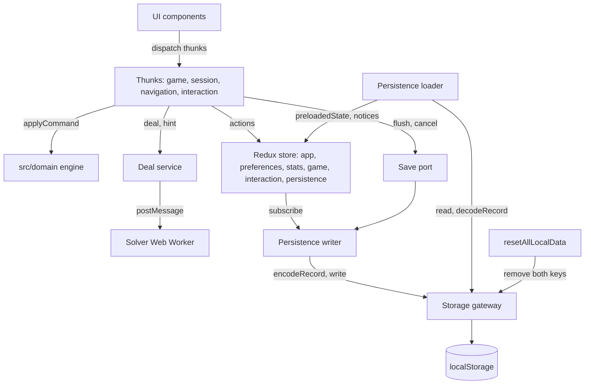

# State and persistence

Redux Toolkit owns application state; the domain engine is called from thunks. Persistence goes through a codec and
a storage gateway. The long-form description of each module is in the [features README](../../src/features/README.md);
this page is the map.

## Store

`src/app/store.ts#createAppStore` combines six slices:

| Slice | File | Holds | Persisted |
| --- | --- | --- | --- |
| `app` | `src/app/appSlice.ts` | route (`home`/`game`), open sheet (one of eight), notices, document visibility, system reduced-motion, dealing progress, `installable`, `updateDeferred` | no |
| `preferences` | `src/features/preferences/preferencesSlice.ts` | the twelve settings | yes |
| `stats` | `src/features/stats/statsSlice.ts` | per-mode stats and Daily record | yes |
| `game` | `src/features/game/gameSlice.ts` | `current`, `history`, `future`, `dailyKey`, `counted`; runtime `busy`, `epoch`, `clock.anchorMs` | `current`, `history`, `future`, `dailyKey`, `counted` (only a started, unfinished game) |
| `interaction` | `src/features/interaction/interactionSlice.ts` | selection, hint, pending hint, announcement log, reported dead ends, win summary | no |
| `persistence` | `src/features/persistence/persistenceSlice.ts` | `readOnly`, `lastError` (`read`/`write`/`null`) | no |

The store's development-only immutability and serializability checks skip `game.history` and `game.future` because
they are large.

## Thunk dependencies

`src/app/thunkExtra.ts#ThunkExtra` is the `extraArgument` every thunk receives. `AppThunk`
(`src/app/appThunk.ts#AppThunk`) is the shared thunk type, importing store types type-only to avoid a runtime cycle.

| Field | Default | Purpose |
| --- | --- | --- |
| `dealService` | a lazy `createDealService` wrapper built in `assembleThunkExtra` | deal and hint; the solver worker starts on first use |
| `now` | `performance.now` | monotonic clock for play time |
| `delay` | `setTimeout` promise | spacing of chains, finish and hint display |
| `today` | `() => new Date()` | source of the UTC Daily key |
| `gateway` | `src/features/persistence/storageGateway.ts#createStorageGateway` | the only door to `localStorage` |
| `saver` | `src/app/savePort.ts#createSavePort` | flush or cancel the pending save without reaching the writer |
| `pwa` | `src/app/thunkExtra.ts#inertPwaPort` | apply update, prompt install; inert unless `main.tsx` supplies real gateways |
| `languages` | `navigator.languages` | first-run language (`resolveLocale`) |

`src/app/thunkExtra.ts#assembleThunkExtra(overrides)` is the one place these are assembled; `createAppStore({
preloadedState, deps })` and `startApp` both call it. Every override wins over its default. Unless the caller injected
its own `dealService`, it builds the lazy default once, reading the final merged `today` at call time. Tests may also
pass `createDealService` to observe or replace how the default service is built.

## Thunks by file

| File | Thunks |
| --- | --- |
| `src/features/game/gameThunks.ts` | `commitCommand`, `play`, `finish`, `undo`, `redo` |
| `src/features/game/sessionThunks.ts` | `startGame`, `restart`, `continueGame`, `playDealCode`, `breakStreakOf` |
| `src/features/game/navigationThunks.ts` | `dealNewGame`, `requestNewDeal`, `restartDeal`, `goHome`, `openSheet`, `closeSheet`, `pause`, `resume` |
| `src/features/interaction/interactionThunks.ts` | `selectCard`, `requestHint`, `checkDeadEnd`, `dealCodeCopied` |
| `src/features/stats/statsThunks.ts` | `todayKey` |
| `src/features/persistence/resetThunks.ts` | `resetStatistics`, `resetAllLocalData` |
| `src/app/pwaThunks.ts` | `applyUpdate`, `installApp` |

- `commitCommand` is the one path every command takes, player or system. It settles the clock, runs
  `src/domain/engine.ts#applyCommand`, records a new undo step (`entry: 'new'`) or updates the current one
  (`'same'`), counts the game as played on its first accepted command, and on the playing-to-won transition records
  the win, the win summary and (Daily with a `dailyKey`) the completed day. A refused command changes nothing but the
  clock settlement.
- `play` is `commitCommand` as a new step. Ignored while `busy`, without a game, or when won. It announces the
  command's events, raises the `no-redeals` notice on a `pass-limit` refusal, and, with the "Auto-move safe cards"
  preference on, chains safe sends (`nextSafeMove`) inside the same undo step, 160 ms apart (0 with reduced motion).
  After the chain it calls `checkDeadEnd`.
- `finish` plays `finishPlan` commands 75 ms apart, the first as a new step and the rest inside it.
- `busy` covers a chain or finish. `epoch` is bumped by every install and clear so a stale sequence stops.
- UI code dispatches the navigation thunks, not `setRoute`/`sheetOpened`/`sheetClosed` directly (an ESLint rule,
  checked by `tests/unit/repo/eslintRules.test.ts`).

## Timer and clock eligibility

Play time is accrued by `src/features/game/gameSlice.ts` reducer `accrued({ atMs, eligible })` and driven by
`src/features/game/clockTicker.ts#createClockTicker` (once on creation, every 250 ms, and whenever eligibility
changes).

`src/features/game/clock.ts#selectClockEligible` is true only when: route is `game`, no sheet is open, the document is
visible, and the game has started and is still `playing`. `busy` is deliberately not part of it. While eligible and
anchored, `accrued` adds whole milliseconds since the anchor, capped at 1 s per step and never negative; when not
eligible the anchor is cleared, so the gap is never counted.

## History

`src/features/game/history.ts` holds pure `commit`, `replace`, `undo`, `redo`, `canUndo`, `canRedo` over
`{ current, history, future }`.

- In memory both stacks are unbounded.
- The saved record keeps the newest 200 undo steps and the nearest 200 redo steps
  (`src/features/persistence/sessionCodec.ts#MAX_STORED_STEPS`).
- Undo restores the earlier piles, score, moves and passes; `elapsedMs` and `started` come from the outgoing
  position, and `undos` is the outgoing value plus one. Redo never refunds an undo charge. Both are no-ops when the
  stack is empty or the game is won.

## Persistence

- Gateway: `src/features/persistence/storageGateway.ts#createStorageGateway` wraps `getItem`/`setItem`/`removeItem`;
  failures (no storage, blocked, full) return `{ ok: false, error }` and are never thrown.
- Codec: `src/features/persistence/recordCodec.ts#encodeRecord` and `#decodeRecord`, with the session part in
  `src/features/persistence/sessionCodec.ts`. The format is in [storage-format.md](../reference/storage-format.md).
- Loader: `src/features/persistence/persistenceLoader.ts#loadInitialState` reads before the store exists and returns
  `preloadedState` plus notices to raise. It never throws and never touches the main record. Its only write is one
  copy of an unreadable record to the backup key.
  - No record: defaults, no notice.
  - Valid record: preferences, stats and the resumable game; `app` is not preloaded so the route stays `home`.
  - `malformed`, `invalid` or `future`: defaults; the raw string is kept in the backup key first. If the backup key is
    empty or already holds the identical string, notice `storage-read`; if it holds different data or cannot be
    read or written, the store starts `readOnly` with notice `storage-read-only`.
  - Storage cannot be read at all: defaults, `readOnly`, `storage-read-only`.
- Writer: `src/features/persistence/persistenceWriter.ts#createPersistenceWriter` subscribes to the store and compares
  the saved parts by reference. A change is written 250 ms after the last one; a change that is only `elapsedMs` is
  written at most every 5 s and never replaces a waiting save. Nothing is written while `persistence.readOnly` is
  set (checked again at write time). A record that encodes to the string already written is skipped. A failed write
  dispatches `writeFailed` and raises `storage-write` once until a write succeeds. `flush` and `flushQuietly` write
  a waiting or failed save now; `cancel` drops it and forgets what was last written; `dispose` also unsubscribes.
- Read-only mode: `persistence.readOnly` is set only through the loader's `preloadedState`. Only
  `persistenceReset` (reset-all) clears the flag.
- Reset: `src/features/persistence/resetThunks.ts#resetStatistics` clears stats and `counted`.
  `resetAllLocalData` clears the game (epoch bump), restores default preferences with the language from
  `languages()`, clears stats, goes Home with no sheet, resets the persistence slice, dismisses the three storage
  notices, calls `saver.cancel()`, then removes both storage keys. A failed remove does not stop the reset.

## Lifecycle

`src/app/lifecycle.tsx#startApp(root, deps?)` runs everything outside React, once. Order:

1. Create a save port and assemble the thunk dependencies with `assembleThunkExtra` (the save port, optional PWA
   port, `deps.extra`).
2. `loadInitialState(gateway, extra.languages())`; create the store from it.
3. Dispatch document visibility and system reduced-motion; raise the loader's notices.
4. `src/app/themeController.ts#createThemeController` and `src/i18n/localeController.ts#createLocaleController`
   write appearance attributes, `<html lang>` and the title, before the first render.
5. Start the clock ticker and the persistence writer; connect the save port to the writer.
6. Attach listeners: `visibilitychange` (updates the store, flushes when hidden), `pagehide` (flushes), the
   reduced-motion media query (if the browser has one).
7. Subscribe to the PWA gateways, if given: update-ready raises the `update-ready` notice; install availability sets
   `installable`.
8. Render `<App />` inside `StrictMode` and `Provider`.

It returns `{ store, dispose }`; `dispose` does not save, so a caller that wants the pending write flushes first.
`src/main.tsx` is the only place that passes the real PWA gateways.

## Related

- [Domain, solver and deal service](domain-and-solver.md)
- [Data flows](data-flows.md)
