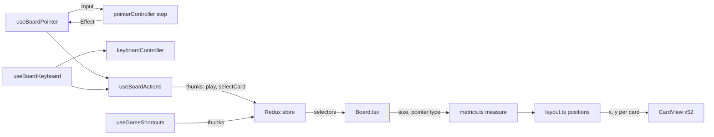

# UI architecture

The UI layer (`src/ui`) renders application state and issues typed commands. It never applies game rules: those live in
`src/domain`, and state lives in Redux (`src/app`, `src/features`). This page is the map; the per-module detail is in
[`src/ui/README.md`](../../src/ui/README.md).

## Layout of `src/ui`

| Folder / file                            | Holds                                                                                                                               |
| ---------------------------------------- | ----------------------------------------------------------------------------------------------------------------------------------- |
| `src/ui/board/`                          | The table: pure geometry and input controllers, plus the React card, slot and `Board` components and their hooks.                   |
| `src/ui/components/`                     | Small shared components: HUD, toolbar, announcer, notices, chips, switches, segmented controls, deal code, build stamp.             |
| `src/ui/screens/`                        | `HomeScreen.tsx`, `GameScreen.tsx`, Home's parts in `screens/home/`, and `profiles.ts`.                                             |
| `src/ui/sheets/`                         | `ModalSheet.tsx` (generic dialog), `SheetHost.tsx` and the eight concrete sheets.                                                   |
| `src/ui/styles/`                         | Plain CSS: `tokens.css`, `cards.css`, `board.css`, `hud.css`, `layout.css`, `controls.css`, `sheets.css`, `home.css`, `global.css`. |
| `src/ui/announce.ts`, `format.ts`        | Localised announcement wording; pure HUD text formatters.                                                                           |
| `src/ui/useMediaQuery.ts`, `useToday.ts` | Small hooks: live media query, current UTC day key.                                                                                 |

`src/App.tsx` mounts the screen for the current route (`selectRoute`), then `SheetHost`, `Notices` and `Announcer` as
siblings of the screen, so they work while a sheet makes the screen behind them `inert`.

The UI must not change the route or open a sheet directly. An ESLint rule on `src/ui/**` (`eslint.config.js`) forbids
importing `setRoute`, `sheetOpened` or `sheetClosed` from `app/appSlice`; components dispatch the intents in
`src/features/game/navigationThunks.ts` (`openSheet`, `closeSheet`, `goHome`, `requestNewDeal`, `pause`, `resume`, ...).

## Board: pure modules and React modules

The board is split so that all geometry and input logic can be unit-tested without a DOM.

**Pure modules** (`src/ui/board/`): each imports only its own siblings and `../../domain/name`; `names.ts` may also
import the translator type from `../../i18n/translate` (type-only). No React, Redux, DOM, storage, `crypto` or
`Math.random`.

| Module                                           | Job                                                                                           |
| ------------------------------------------------ | --------------------------------------------------------------------------------------------- |
| `src/ui/board/metrics.ts#measure`                | Board size + pointer type to card size, spacing, wide-or-stacked table choice, compact flag.  |
| `src/ui/board/layout.ts#positions`               | Piles + metrics to a placement for every card, the slots, the stock badge and the deal order. |
| `src/ui/board/names.ts#cardName`                 | Localised accessible names of cards and piles (`pileName`, `pileLabel`).                      |
| `src/ui/board/locate.ts#cardIndex`               | Card id to `{ from, index, faceUp, movable }`.                                                |
| `src/ui/board/landing.ts#pickLargestOverlap`     | Landing rectangles for drag/hint; drop target by largest overlap; `pileAt` reverse lookup.    |
| `src/ui/board/pointerController.ts#step`         | Pointer state machine (idle, pressed, dragging), plain-data inputs and effects.               |
| `src/ui/board/keyboardController.ts#keyToAction` | Key event to action; `moveFocus`, `pileOrder`, `defaultStop` for roving focus.                |
| `src/ui/board/cascadeFrames.ts#cascadeFrames`    | Paths for the win cascade.                                                                    |

Enforcement: an ESLint override on exactly these eight files (`eslint.config.js`) and
`tests/unit/repo/boardPurity.test.ts`. See [testing](../development/testing.md).

**React modules** (`src/ui/board/`): `Board.tsx` (the panel; one persistent `CardView` for each of the 52 cards in card-id
order, plus `PileSlot`, `StockBadge`, `Ghosts`), hooks (`useBoardSize`, `useResizeSettle`, `useDealAnimation`,
`useCascade`, `useWinSheet`, `useBoardActions`, `useBoardPointer`, `useBoardKeyboard`, `useGameShortcuts`), selectors
(`selectors.ts`) and runners (`animations.ts`, `cascade.ts`). `constants.ts` holds a few shared constants;
`tests/unit/ui/motionConstants.test.ts` fails if `CARD_RADIUS_FACTOR` or `DEAL_STEP_MS` drifts from
`--card-radius-factor` / `--motion-deal-step` in `tokens.css`.

## Cards, motion and the no-motion path

- Each card has one persistent element (52 in id order), positioned by inline `--x` / `--y`. A move therefore changes
  only a position, and the CSS transition animates it. Undo, redo, restart and new deal need no special case.
- Only `transform` is transitioned. `.card` glides over `--motion-glide`; `.card-inner` flips over `--motion-flip`.
  `--d` and `--fd` (delays) are written only by the deal runner (`src/ui/board/animations.ts`).
- One motion signal: `src/app/selectors.ts#selectReducedMotion` is true when the Animations preference is off or the
  device asks for reduced motion (`systemReducedMotion`, set from `(prefers-reduced-motion: reduce)` in
  `src/app/lifecycle.tsx`).
- `src/app/themeController.ts#createThemeController` writes that signal to the document element as
  `data-motion='off'` or `'on'`. Stylesheets select on `:root[data-motion='off']` to disable transitions and
  animations. No stylesheet uses `prefers-reduced-motion`.
- Runners read `selectReducedMotion` directly: the deal (`useDealAnimation`) and the win cascade (`useCascade`) do not
  play under reduced motion, and the refused-move shake is skipped (`useBoardActions`); the announcement still happens.
- On a size change, `useResizeSettle` sets `data-resizing="true"` on the board for one frame so cards jump instead of
  gliding.
- Deal: while `data-dealing="park"` is set, cards sit on the stock with transitions off, then glide out in deal order.
- Win cascade: `useCascade` plays once when a game turns from playing to won in the same epoch. The Win sheet opens
  2,400 ms later, or at once under reduced motion (`src/ui/board/useWinSheet.ts`).

## Input paths

Every move is reachable by tap, drag and keyboard (project principle 5). All three end in the same commands
(`play` thunk with a `move` or `draw` command). Control details are in
[keyboard and controls](../reference/keyboard-and-controls.md).

### Input gate

`src/features/interaction/selectors.ts#selectInputEnabled` is the one gate. The board accepts input only when the route is
`game`, no deal is being prepared, no sheet is open, a game exists and is not won, and no safe-card chain or Finish is
running (`busy`). Pointer, keyboard, the toolbar's Hint and Finish, and most global shortcuts read it. A closing gate
cancels a drag (`gateClosed` input).

### Pointer

`src/ui/board/useBoardPointer.ts#useBoardPointer` attaches delegated listeners to the board element and feeds
`src/ui/board/pointerController.ts#step`. The hook resolves each press to a `Hit` (`card`, `slot`, `stock`, `column`,
`none`), captures the pointer, and applies the effects (`tap`, `dragStart`, `dragMove`, `drop`, `cancel`). During a drag
it writes `--dx`, `--dy`, `--k` straight on the dragged elements, with no React state per frame. `pointercancel`, a lost
capture, a resize, a closing gate, and Escape (while dragging) cancel the drag.

### Tap

`src/ui/board/useBoardActions.ts#useBoardActions` returns `{ activate, pickUp }`, shared by pointer and keyboard.
The `tapMode` preference selects the behaviour: `smart` (default; a tap sends the card to `bestTarget`) or `select`
(pick up, then tap a target). Details are in the controls reference.

### Keyboard

- Roving focus: `src/ui/board/useBoardKeyboard.ts#useBoardKeyboard` keeps exactly one board element tabbable. Tab,
  Shift+Tab and arrows move through `keyboardController.ts#moveFocus`. The focus position is an anchor (pile + card), so
  it follows a card that moves and resets on a new game epoch. Tab order is `pileOrder(stockRight)`.
- Global shortcuts: `src/ui/board/useGameShortcuts.ts#useGameShortcuts`, mounted by `GameScreen`, binds one `keydown`
  listener on `window`. `N` and `P` bypass the input gate (they use `selectGameControlsIdle` instead). Everything else
  checks the gate.
- `keyToAction` ignores Alt combinations and text fields, and resolves letters by layout-independent rules (Latin key as
  typed, otherwise the physical `code`), so shortcuts work on a Ukrainian layout.

## Screens and layout profiles

- **Home** (`src/ui/screens/HomeScreen.tsx`): top bar, hero, mode tiles, Winnable switch, actions (Deal cards, Continue
  game, How to play), LCD record strip, links (Statistics, Settings, Play a deal code, About, and Install app when the
  browser offers it).
- **Game** (`src/ui/screens/GameScreen.tsx`): a hidden `h1`, a dealing status line, the top bar (Back, mode and deal
  chips, theme toggle, Settings), the HUD (Score or Bank, Moves, New deal, Time), a hint line, the `Board`, the
  `Toolbar` (Undo, Redo, Hint, Finish) and a footer (build stamp, deal code). It mounts `useGameShortcuts`.

Two separate "wide vs narrow" decisions exist; do not confuse them.

1. **Chrome profile: stacked or side rails.** `src/ui/screens/profiles.ts#RAILS_QUERY` is
   `(orientation: landscape) and (max-height: 720px)`. CSS selects the profile. `GameScreen` uses
   `useMediaQuery(RAILS_QUERY)` only to decide where the single Back button lives. `styles/layout.css` repeats the
   query literally, and `tests/unit/ui/layoutCss.test.ts` fails if the two drift.
2. **Table geometry: stacked or wide.** `metrics.ts#measure` chooses it from the board size and pointer type
   (`wide` in the returned metrics). In the wide table, stock and waste share one side column and the foundations the
   other; the `stockRight` preference swaps the sides.

Device-fit coverage of these (52 configurations, plus a padded-text pass) is described in
[testing](../development/testing.md).

## Sheets

`src/ui/sheets/SheetHost.tsx#SheetHost` maps `SheetId` (`src/app/appSlice.ts`) to a component. All are wrapped in
`ModalSheet.tsx` (scrim, `role="dialog"`, focus trap, Escape and backdrop dismissal unless `dismissable={false}`, focus
return to the opener). While a sheet is open, `App` marks the screen behind it `inert`.

| Sheet id   | Component                         | Notes                                                                                  |
| ---------- | --------------------------------- | -------------------------------------------------------------------------------------- |
| `settings` | `src/ui/sheets/SettingsSheet.tsx` | Appearance, Play, Language, Data groups; every control writes `preferenceSet` at once. |
| `help`     | `src/ui/sheets/HelpSheet.tsx`     | Rules, controls table, scoring, Winnable deals and grades.                             |
| `stats`    | `src/ui/sheets/StatsSheet.tsx`    | Per-mode table, Daily streak, Reset.                                                   |
| `newDeal`  | `src/ui/sheets/NewDealSheet.tsx`  | Shown for a started, unwon game; Restart, New deal, Cancel (initial focus).            |
| `paused`   | `src/ui/sheets/PausedSheet.tsx`   | Frozen time, deal code, Resume; `GameScreen` hides the board while open.               |
| `win`      | `src/ui/sheets/WinSheet.tsx`      | Not dismissable; only Menu or Deal again leave it.                                     |
| `dealCode` | `src/ui/sheets/DealCodeSheet.tsx` | A form; `playDealCode` thunk validates.                                                |
| `about`    | `src/ui/sheets/AboutSheet.tsx`    | Version (`__APP_VERSION__`), build stamp, links, privacy line.                         |

## Announcer and notices

- `src/ui/components/Announcer.tsx#Announcer`: the one polite live region (`role="status"`, visually hidden). It speaks
  new items of the announcement log (`state.interaction.announcement`) using `src/ui/announce.ts#formatAnnouncement`.
  Descriptors in the log carry no text, so wording follows the active locale.
- `src/ui/components/Notices.tsx#Notices`: transient and persistent messages from `state.app.notices`. `dead-end`,
  `no-redeals` and `code-copied` disappear after `NOTICE_MS` (3,200 ms). Storage notices and `update-ready` stay until
  dismissed. A notice never takes focus or blocks the board.
- Both are mounted once by `App`, outside every screen.

## CSS tokens, themes and appearance preferences

All colours, sizes and motion timings are CSS custom properties in `src/ui/styles/tokens.css`. Other stylesheets use
tokens only (checked by `tests/unit/ui/tokens.test.ts`; contrast by `tests/unit/ui/contrast.test.ts`).

The theme controller (`src/app/themeController.ts#createThemeController`) applies preferences to `<html>` as attributes,
and the stylesheets select on them:

| Preference (`src/features/preferences/preferencesSlice.ts`) | Attribute on `<html>` | Values                                                             |
| ----------------------------------------------------------- | --------------------- | ------------------------------------------------------------------ |
| `theme` (`light`, `dark`, `system`)                         | `data-theme`          | `light` or `dark` (System is resolved from `prefers-color-scheme`) |
| `nightCards`                                                | `data-night-cards`    | `true` / `false`                                                   |
| `fourColor`                                                 | `data-four-color`     | `true` / `false`                                                   |
| `cardBack` (`harbour`, `navy`, `sky`, `coral`)              | `data-back`           | the chosen back                                                    |
| `animations` + device reduced-motion                        | `data-motion`         | `on` / `off`                                                       |

Other preferences (`tapMode`, `highlight`, `autoSafe`, `stockRight`, `locale`, `winnableOnly`, `selectedMode`, `difficulty`) are read
by components and thunks, not applied as attributes. `locale` is applied to `<html lang>` and the document title by
the locale controller (see [i18n and PWA](i18n-and-pwa.md)).

## See also

- [`src/ui/README.md`](../../src/ui/README.md) for module-level detail.
- [Architecture overview](overview.md), [keyboard and controls](../reference/keyboard-and-controls.md),
  [testing](../development/testing.md).
