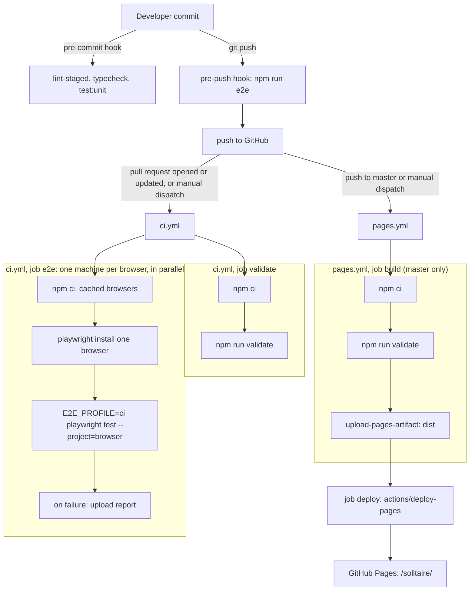

# CI and deployment

The app is a static site deployed to GitHub Pages under `/solitaire/`. Two workflows exist:
`.github/workflows/ci.yml` (checks) and `.github/workflows/pages.yml` (deploy). `ci.yml` builds pull requests and runs the end-to-end suite in a lean
profile; `pages.yml` builds `master` and deploys it without Playwright. The full suite runs locally.

## Flow



## The `validate` chain

`npm run validate` (in `package.json`) runs these in order and stops at the first failure:

```
format:check && lint && typecheck && validate:lifecycle-storage && vitest run tests/unit tests/component --coverage && build && validate:artifact
```

`tests/unit/repo/configContract.test.ts` asserts this exact order and that `.prettierignore` leaves `docs/` checked.

| Step                         | Command                                            | What it checks                                                                                                                                                                                                                 |
| ---------------------------- | -------------------------------------------------- | ------------------------------------------------------------------------------------------------------------------------------------------------------------------------------------------------------------------------------ |
| `format:check`               | `prettier --check .`                               | Formatting: 4-space indent, 120 columns, semicolons, single quotes, trailing commas.                                                                                                                                           |
| `lint`                       | `eslint .`                                         | `typescript-eslint` strict and stylistic type-checked rules, react-hooks, and the import restrictions in `eslint.config.js` (layer purity, no solver value imports in features, no direct route or sheet changes from the UI). |
| `typecheck`                  | `tsc -b --pretty false`                            | TypeScript strict, no unused locals or parameters; includes the type-level catalog completeness test.                                                                                                                          |
| `validate:lifecycle-storage` | `node scripts/validate-lifecycle-storage.mjs`      | Lifecycle tests reach storage only through an injected gateway (details in [testing](testing.md)).                                                                                                                             |
| unit and component tests     | `vitest run tests/unit tests/component --coverage` | All unit, component and repo guard tests (including the docs-link, no-spec-pack and traceability guards), with the 80% coverage floor.                                                                                         |
| `build`                      | `tsc -b && vite build`                             | Type-check, then build into `dist/` with the `/solitaire/` base, the service worker and the solver worker chunk.                                                                                                               |
| `validate:artifact`          | `node scripts/validate-artifact.mjs`               | Checks the built `dist/` (below).                                                                                                                                                                                              |

### `scripts/validate-artifact.mjs`

Runs four checks over `dist/` (or a path given as an argument) and exits non-zero, listing each problem.

1. `checkLocalReferences`: every local `src` or `href` in `dist/index.html` (anchors excluded) starts with `/solitaire/`.
2. `checkManifest`: `manifest.webmanifest` exists; `start_url` and `scope` equal `/solitaire/`; `display` is
   `standalone`; each icon exists under the base; at least one icon is `maskable`.
3. `checkServiceWorker`: `sw.js` exists and precaches `index.html`, `manifest.webmanifest` and every emitted script
   (except `sw.js` and the Workbox runtime), stylesheet, font and icon; the solver worker chunk
   (`solver.worker*.js`) exists.
4. `checkNoThirdPartyLoads`: nothing the app loads points at another origin: HTML `src`/`href` (not anchors), CSS
   `url()` and `@import`, manifest URLs, `sw.js` precache entries, and string arguments of `import()`,
   `new Worker`, `new URL(..., import.meta.url)` and `importScripts`. Plain URL text (for example in a link the player
   clicks) is not inspected.

`tests/unit/repo/validateArtifact.test.ts` runs the checks against the mini trees in `tests/fixtures/dist/`.

### `scripts/validate-lifecycle-storage.mjs`

Reads every `tests/component/appLifecycle*.test.tsx` and fails when one names `localStorage`, `sessionStorage` or
`Storage.prototype`, builds a bare `createStorageGateway()`, or calls `startApp(` without a `gateway`. It also fails if
no such file exists.

Other scripts, none part of `validate`: `scripts/trace-requirements.mjs` (`npm run trace`) regenerates the
[traceability matrix](../reference/traceability.md), which `tests/unit/repo/traceability.test.ts` checks inside the
unit run; `scripts/generate-icons.mjs` regenerates `public/favicon.svg` and the icons in `public/icons/`;
`scripts/build-info.mjs` builds the stamp below. See [scripts reference](../reference/scripts.md).

## Git hooks (husky)

Installed by the `prepare` script (`husky`). Hooks live in `.husky/`.

| Hook                | Runs                                                                                                                                                                            |
| ------------------- | ------------------------------------------------------------------------------------------------------------------------------------------------------------------------------- |
| `.husky/pre-commit` | `npx lint-staged` (Prettier and ESLint `--fix` on staged `*.{ts,tsx}`; Prettier on staged `*.{json,css,html,md,yml,yaml}`), then `npm run typecheck`, then `npm run test:unit`. |
| `.husky/pre-push`   | `npm run e2e` (all Playwright projects).                                                                                                                                        |

The pre-commit hook lints only staged files, so it does not replace `validate`. The project rule is to run the full
`rtk npm run validate` before every commit (see [workflow](workflow.md)).

## `ci.yml`

Triggers: `pull_request` (opened and every new commit) and manual `workflow_dispatch`; there is no `push` trigger, so a
commit on a branch with an open pull request is built once, not twice (a branch without a pull request is not built; open a
draft pull request or dispatch the workflow by hand). A `concurrency` group per ref cancels the older run when a newer
commit arrives. Permissions: `contents: read`. Two kinds of job run in parallel on
`ubuntu-latest` (neither waits for the other, so the run takes as long as the slowest). GitHub Actions supplies
`GITHUB_RUN_NUMBER` itself, so the build carries a build number.

- **`validate`** (15 min cap): checkout, `actions/setup-node` (Node 22.22.2, npm cache), `npm ci`, `npm run validate`.
  No Playwright.
- **`e2e`** (25 min cap), a matrix of `chromium`, `firefox` and `webkit` with `fail-fast: false`, so each browser has its
  own machine: checkout, setup-node, `npm ci`, `actions/cache` for `~/.cache/ms-playwright`,
  `npx playwright install --with-deps <browser>`, then `npx playwright test --project=<browser>` with
  `E2E_PROFILE=ci`. Playwright's `webServer` builds and previews the app on port 5173. On failure it uploads
  `playwright-report/` and `test-results/` as `playwright-report-<browser>`.

The **lean CI profile** (`E2E_PROFILE=ci`, read by `playwright.config.ts`; a dedicated variable because `CI` is also set
in the `validate` job, where the config tests need every project) differs from a local run in these ways:

| Local (`npm run e2e`, pre-push hook)                    | CI profile                                                                                   |
| ------------------------------------------------------- | -------------------------------------------------------------------------------------------- |
| seven projects: three engines, three phones, device-fit | `chromium`, `firefox`, `webkit` only                                                         |
| every spec                                              | no keyboard titles (`grepInvert: /keyboard/i`), no `dealLatency`, `dragPerf`, `visualParity` |
| no retries (2 on any `CI`)                              | 1 retry, 2 workers, 90 s per test, 15 s per expectation, `maxFailures: 10`                   |
| every spec in every engine                              | `playByTap`, `playByDrag`, `playModes` and `history` skipped in `webkit` only                |

Why: the informational specs and the phone projects took most of a 57-minute run on a 4-core runner, and a hung test
repeated three times cost nine minutes. Reproduce a shard locally with
`E2E_PROFILE=ci npx playwright test --project=webkit`. CI does not write the `visual-parity` screenshots; review them
locally with `npx playwright test visualParity --project=chromium`, and regenerate the committed reference screenshots
with `npm run screenshots` (opt-in and local).

Actions are pinned to exact versions; `tests/unit/repo/configContract.test.ts` checks the pins. Per the project rule, look
up the latest versions before updating them.

## `pages.yml`

Triggers: push to `master` and manual `workflow_dispatch`. Concurrency group `pages` with `cancel-in-progress: false`
(a deploy in progress finishes). Top-level permissions: `contents: read`.

- Job `build`: guarded by `if: github.ref == 'refs/heads/master'`, so a manual dispatch from another branch builds
  nothing. Same setup as CI (checkout, Node 22.22.2, `npm ci`), then `npm run validate`, which already builds `dist/`
  (no second build step; the config test asserts this), then `actions/upload-pages-artifact` with `path: dist`.
- Job `deploy`: `needs: build`; the only job with `pages: write` and `id-token: write`; environment `github-pages`
  whose URL is the deployment's `page_url`; uses `actions/deploy-pages`.

Playwright is not run in `pages.yml` (the job has a 15 min cap): a release is a pull request that already passed `ci.yml`
before it was merged, so the release only re-validates and deploys. Whether master is
protected so that Pages deploys only after a green CI is a repository setting that is not recorded in the repo.
The repository's Pages source is GitHub Actions (`build_type: workflow`, read from the GitHub Pages API).

## Base path `/solitaire/`

The site lives at a sub-path, so every URL must carry it.

- `vite.config.ts`: `base: '/solitaire/'`.
- `index.html`: manifest, favicon and Apple touch icon links start with `/solitaire/`.
- `public/manifest.webmanifest`: `start_url`, `scope` and icon paths use `/solitaire/`.
- `vitest.config.ts`: jsdom URL `http://localhost/solitaire/`. `playwright.config.ts`: `baseURL`
  `http://127.0.0.1:5173/solitaire/`.
- Guards: `tests/unit/repo/configContract.test.ts` (base in all three configs), `tests/unit/repo/manifest.test.ts`, and
  `validate:artifact` checks 1 and 2 on the build.

Dev server: `npm run dev` serves at <http://localhost:5173/solitaire/>.

## Build identity and version

`vite.config.ts` defines two compile-time constants:

| Constant          | Value                                                                                          |
| ----------------- | ---------------------------------------------------------------------------------------------- |
| `__APP_BUILD__`   | `resolveBuildInfo(process.env, new Date())` from `scripts/build-info.mjs`: `{ number, time }`. |
| `__APP_VERSION__` | `version` from `package.json` (read with `readFileSync`, not hard-coded).                      |

`number` is `GITHUB_RUN_NUMBER` (trimmed; unset, empty or blank means no number, `null`). `time` is the moment the build
ran in UTC, formatted `YYYY-MM-DD HH:mm UTC` whatever the machine's time zone. Neither workflow passes anything
itself: GitHub Actions sets `GITHUB_RUN_NUMBER`, so both the CI end-to-end build and the deployed Pages build carry a
number. The build stamp component (`src/ui/components/BuildStamp.tsx#BuildStamp`) shows "App build: Build 57 ·
2026-09-28 14:03 UTC", or "App build: Development build · 2026-09-28 14:03 UTC" when there is no number; the number and
time are never translated. Vitest defines a fixed `__APP_BUILD__` (`vitest.config.ts`). The About sheet shows the
stamp and the version. To reproduce a CI stamp locally: `GITHUB_RUN_NUMBER=7 npm run build`.

## GitHub Pages deployment

1. A commit lands on `master`: a feature branch reaches it by a pull request, as the [release procedure](release.md) describes (branch rules are in [workflow](workflow.md)).
2. `pages.yml` builds and validates, uploads `dist/` as the Pages artifact, and `deploy` publishes it.
3. The service worker precaches the new build. Returning players see the "new version ready" notice and choose Update or
   Later; see [i18n and PWA](../architecture/i18n-and-pwa.md).

Artifacts generated by the build (`dist`, `coverage`, `playwright-report`) are not committed.
