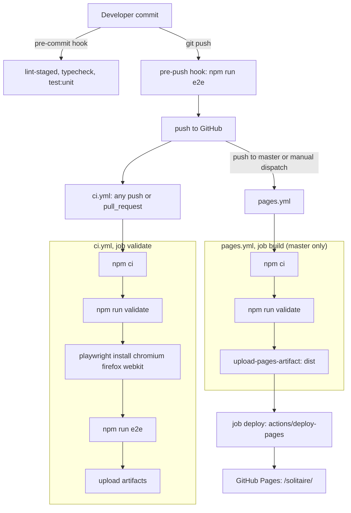

# CI and deployment

The app is a static site deployed to GitHub Pages under `/solitaire/`. Two workflows exist:
`.github/workflows/ci.yml` (checks) and `.github/workflows/pages.yml` (deploy). Both run the same `validate` script.

## Flow



## The `validate` chain

`npm run validate` (in `package.json`) runs these in order and stops at the first failure:

```
format:check && lint && typecheck && validate:lifecycle-storage && test:unit && build && validate:artifact
```

`tests/unit/repo/configContract.test.ts` asserts this exact order.

| Step                         | Command                                       | What it checks                                                                                                                                                                                                                 |
| ---------------------------- | --------------------------------------------- | ------------------------------------------------------------------------------------------------------------------------------------------------------------------------------------------------------------------------------ |
| `format:check`               | `prettier --check .`                          | Formatting: 4-space indent, 120 columns, semicolons, single quotes, trailing commas.                                                                                                                                           |
| `lint`                       | `eslint .`                                    | `typescript-eslint` strict and stylistic type-checked rules, react-hooks, and the import restrictions in `eslint.config.js` (layer purity, no solver value imports in features, no direct route or sheet changes from the UI). |
| `typecheck`                  | `tsc -b --pretty false`                       | TypeScript strict, no unused locals or parameters; includes the type-level catalog completeness test.                                                                                                                          |
| `validate:lifecycle-storage` | `node scripts/validate-lifecycle-storage.mjs` | Lifecycle tests reach storage only through an injected gateway (details in [testing](testing.md)).                                                                                                                             |
| `test:unit`                  | `vitest run tests/unit tests/component`       | All unit, component and repo guard tests.                                                                                                                                                                                      |
| `build`                      | `tsc -b && vite build`                        | Type-check, then build into `dist/` with the `/solitaire/` base, the service worker and the solver worker chunk.                                                                                                               |
| `validate:artifact`          | `node scripts/validate-artifact.mjs`          | Checks the built `dist/` (below).                                                                                                                                                                                              |

### `scripts/validate-artifact.mjs`

Runs four checks over `dist/` (or a path given as an argument) and exits non-zero, listing each problem.

1. `checkLocalReferences`: every local `src` or `href` in `dist/index.html` (anchors excluded) starts with `/solitaire/`.
2. `checkManifest`: `manifest.webmanifest` exists; `start_url` and `scope` equal `/solitaire/`; `display` is
   `standalone`; each icon exists under the base; at least one icon is `maskable`.
3. `checkServiceWorker`: `sw.js` exists and precaches `index.html`, `manifest.webmanifest` and every emitted script
   (except `sw.js` and the Workbox runtime), stylesheet, font and icon; the solver worker chunk
   (`solver.worker*.js`) exists.
4. `checkNoThirdPartyLoads`: nothing the app loads points at another origin: HTML `src`/`href` (not anchors), CSS
   `url()` and `@import`, manifest URLs, `sw.js` precache entries, and string arguments of `import()`,
   `new Worker`, `new URL(..., import.meta.url)` and `importScripts`. Plain URL text (for example in a link the player
   clicks) is not inspected.

`tests/unit/repo/validateArtifact.test.ts` runs the checks against the mini trees in `tests/fixtures/dist/`.

### `scripts/validate-lifecycle-storage.mjs`

Reads every `tests/component/appLifecycle*.test.tsx` and fails when one names `localStorage`, `sessionStorage` or
`Storage.prototype`, builds a bare `createStorageGateway()`, or calls `startApp(` without a `gateway`. It also fails if
no such file exists.

Other scripts: `scripts/generate-icons.mjs` regenerates the icons in `public/icons/` (not part of `validate`). See
[scripts reference](../reference/scripts.md).

## Git hooks (husky)

Installed by the `prepare` script (`husky`). Hooks live in `.husky/`.

| Hook                | Runs                                                                                                                                                                            |
| ------------------- | ------------------------------------------------------------------------------------------------------------------------------------------------------------------------------- |
| `.husky/pre-commit` | `npx lint-staged` (Prettier and ESLint `--fix` on staged `*.{ts,tsx}`; Prettier on staged `*.{json,css,html,md,yml,yaml}`), then `npm run typecheck`, then `npm run test:unit`. |
| `.husky/pre-push`   | `npm run e2e` (all Playwright projects).                                                                                                                                        |

The pre-commit hook lints only staged files, so it does not replace `validate`. The project rule is to run the full
`rtk npm run validate` before every commit (see [workflow](workflow.md)).

## `ci.yml`

Triggers: every `push` and every `pull_request`. Permissions: `contents: read`. One job, `validate`, on
`ubuntu-latest`, with `BUILD_TIMESTAMP` set to `github.run_started_at`. Steps:

1. `actions/checkout`.
2. `actions/setup-node` with Node 22.22.2 and the npm cache.
3. `npm ci`.
4. `npm run validate`.
5. `npx playwright install --with-deps chromium firefox webkit`.
6. `npm run e2e` (all seven projects; 2 retries; `forbidOnly`). Playwright's `webServer` runs `npm run build` and
   `npm run preview` again on port 5173, because CI does not reuse an existing server.
7. On failure: upload `playwright-report/` and `test-results/` as artifact `playwright-report`.
8. Always: upload `test-results/visual-parity/` as artifact `visual-parity` (screenshots for manual comparison with the
   mockup; `if-no-files-found: warn`).

Actions are pinned to exact versions; `tests/unit/repo/configContract.test.ts` checks the pins. Per the project rule, look
up the latest versions before updating them.

## `pages.yml`

Triggers: push to `master` and manual `workflow_dispatch`. Concurrency group `pages` with `cancel-in-progress: false`
(a deploy in progress finishes). Top-level permissions: `contents: read`.

- Job `build`: guarded by `if: github.ref == 'refs/heads/master'`, so a manual dispatch from another branch builds
  nothing. Same setup as CI (checkout, Node 22.22.2, `npm ci`), then `npm run validate`, which already builds `dist/`
  (no second build step; the config test asserts this), then `actions/upload-pages-artifact` with `path: dist`.
- Job `deploy`: `needs: build`; the only job with `pages: write` and `id-token: write`; environment `github-pages`
  whose URL is the deployment's `page_url`; uses `actions/deploy-pages`.

Playwright is not run in `pages.yml`; the end-to-end suite runs in `ci.yml` (pushes and pull requests). Whether master is
protected so that Pages deploys only after a green CI: TODO: confirm (repository settings are not in the repo).
The repository's Pages source must be set to GitHub Actions: TODO: confirm.

## Base path `/solitaire/`

The site lives at a sub-path, so every URL must carry it.

- `vite.config.ts`: `base: '/solitaire/'`.
- `index.html`: manifest, favicon and Apple touch icon links start with `/solitaire/`.
- `public/manifest.webmanifest`: `start_url`, `scope` and icon paths use `/solitaire/`.
- `vitest.config.ts`: jsdom URL `http://localhost/solitaire/`. `playwright.config.ts`: `baseURL`
  `http://127.0.0.1:5173/solitaire/`.
- Guards: `tests/unit/repo/configContract.test.ts` (base in all three configs), `tests/unit/repo/manifest.test.ts`, and
  `validate:artifact` checks 1 and 2 on the build.

Dev server: `npm run dev` serves at <http://localhost:5173/solitaire/>.

## Build timestamp and version

`vite.config.ts` defines two compile-time constants:

| Constant                  | Value                                                                     |
| ------------------------- | ------------------------------------------------------------------------- |
| `__APP_BUILD_TIMESTAMP__` | `process.env.BUILD_TIMESTAMP`, else the string `dev version`.             |
| `__APP_VERSION__`         | `version` from `package.json` (read with `readFileSync`, not hard-coded). |

Both CI workflows set `BUILD_TIMESTAMP` to `github.run_started_at`. The build stamp component
(`src/ui/components/BuildStamp.tsx#BuildStamp`) shows the timestamp, or a localised "dev" text when Vite did not define it
(as under Vitest); the About sheet shows the version. To reproduce a deployed stamp locally:
`BUILD_TIMESTAMP=2026-01-01T00:00:00Z npm run build`.

## GitHub Pages deployment

1. A commit lands on `master` (how the integration branch reaches `master`: TODO: confirm; branch rules are in [workflow](workflow.md)).
2. `pages.yml` builds and validates, uploads `dist/` as the Pages artifact, and `deploy` publishes it.
3. The service worker precaches the new build. Returning players see the "new version ready" notice and choose Update or
   Later; see [i18n and PWA](../architecture/i18n-and-pwa.md).

Artifacts generated by the build (`dist`, `coverage`, `playwright-report`) are not committed.
