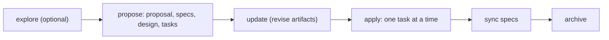

# Development workflow

## OpenSpec is the way to introduce features

Behaviour changes, new features and non-trivial refactors go through OpenSpec (`openspec/`, schema `spec-driven`).
Do not start such work by editing code directly.



| Step    | Skill / command                                   | Result                                                                    |
| ------- | ------------------------------------------------- | ------------------------------------------------------------------------- |
| Explore | `openspec-explore` / `/opsx:explore`              | Thinking and investigation; no artifacts required.                        |
| Propose | `openspec-propose` / `/opsx:propose`              | `openspec/changes/<name>/` with proposal, delta specs, design (when needed) and `tasks.md`. |
| Update  | `openspec-update-change` / `/opsx:update`         | Revises planning artifacts and keeps them consistent. Never edits code.   |
| Apply   | `openspec-apply-change` / `/opsx:apply`           | Implements tasks, checking each off in `tasks.md`.                        |
| Sync    | `openspec-sync-specs` / `/opsx:sync`              | Merges the change's delta specs into `openspec/specs/`.                   |
| Archive | `openspec-archive-change` / `/opsx:archive`       | Moves the change to `openspec/changes/archive/<date>-<name>/`.            |

The skills live in `.claude/skills/` and `.agents/skills/`; the slash commands in `.claude/commands/opsx/`. Project-specific
rules for artifacts (capability naming, requirement traceability to `KS-*` ids, task sizing, apply/archive guidance) are in
`openspec/config.yaml`.

Where things are:

- `openspec/specs/<layer>/<capability>/spec.md`: the current requirements, grouped by layer (`app`, `domain`, `features`, `i18n`, `pwa`, `solver`, `tooling`, `ui`).
- `openspec/changes/`: active changes. `openspec/changes/archive/`: finished ones (history; do not edit).
- `docs/spec/`: the original product specification pack (`KS-*` requirement ids). Source for requirement traceability, otherwise frozen.

Small fixes (typos, a failing test, a documentation correction) do not need a change.

## Applying a change

`AGENTS.md` ("Sub-agent driven workflow") is authoritative. In short:

1. Work one task at a time. Read only that task's requirements and files.
2. Test first, then implement, then verify, then review with a fresh context.
3. Move the task's checkbox from `- [ ]` to `- [x]` in `tasks.md` only after verification.
4. If a task needs more than it states, stop and surface the extra scope.
5. Commit each finished task (including the `tasks.md` edit) before starting the next.

## Branches and commits

- Never work on `master`.
- `master` is the release branch.
- Each change runs on `feature/<change-name>`, cut from the active integration branch (named in the change's proposal, `feature/app-v1-release` for `finalize-v1-release`) or from `master` when there is none.
- At archive the change branch is squash-merged into the integration branch, which reaches `master` by pull request.
- Conventional Commit subjects (`feat: ...`, `fix: ...`, `docs: ...`).
- Commit or push only when asked, except the per-task commits above (push always needs an explicit request).
- Do not commit `dist/`, coverage or Playwright output (they are ignored).

## Before every commit

Run the full, unmodified gate and fix everything it reports:

```sh
npm run validate
```

The pre-commit hook only lints staged files, so it does not replace `validate`.

## Git hooks

Installed by husky (`prepare` script):

- `.husky/pre-commit`: `npx lint-staged` (Prettier and ESLint on staged `*.ts`/`*.tsx`; Prettier on staged json, css, html, md, yml), then `npm run typecheck`, then `npm run test:unit`.
- `.husky/pre-push`: `npm run e2e`.

## Documentation is part of the change

When a change alters behaviour, scripts, configuration, CI, storage shape, source layout or user-facing controls, update the
matching page in the same change:

| Fact                                 | Page                                                         |
| ------------------------------------ | ------------------------------------------------------------ |
| npm scripts                          | [reference/scripts.md](../reference/scripts.md)              |
| Stored record                        | [reference/storage-format.md](../reference/storage-format.md) |
| Shortcuts and input                  | [reference/keyboard-and-controls.md](../reference/keyboard-and-controls.md) |
| Rules, modes, scoring                | [reference/game-rules.md](../reference/game-rules.md)        |
| Layers and dependency rules          | [architecture/overview.md](../architecture/overview.md), [code-standards.md](code-standards.md) |
| Tests and guards                     | [testing.md](testing.md)                                     |
| CI, deployment, validation           | [ci-and-deployment.md](ci-and-deployment.md)                 |
| Module internals                     | the module's own `README.md` under `src/`                    |
| Overall status and layout            | `README.md`, `AGENTS.md`                                     |
