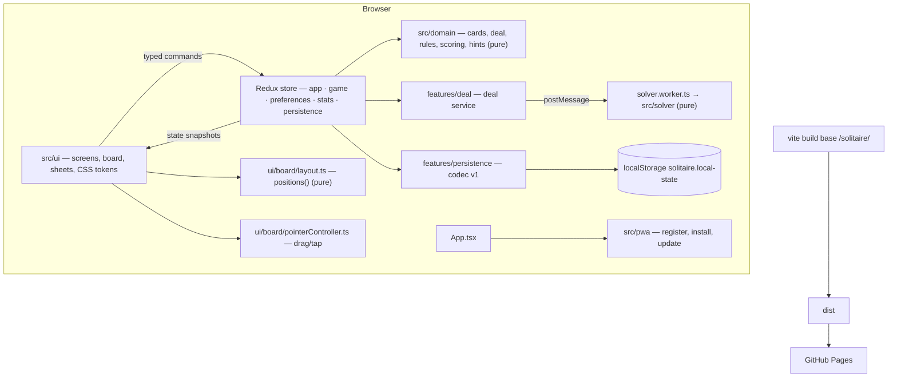

# Klondike Solitaire — Phased Design & Implementation Plan

> **Role of this file.** *How* to build the app and *in which order*. It fixes the stack, architecture, data model and algorithms, then splits the work into phases. Each phase is sized to be one GitHub Speckit feature (`/speckit.specify` → `/speckit.clarify` → `/speckit.plan` → `/speckit.tasks` → `/speckit.implement`). Every phase lists its goal, the requirement IDs it satisfies (from `specification.md`), its deliverables, a verifiable "done when" and a **Speckit seed prompt** to paste into `/speckit.specify`.
>
> Sibling project for conventions: `sanyokkua/minesweeper` (Vite + React + TypeScript + Redux Toolkit + vite-plugin-pwa + Vitest + Playwright + GitHub Pages). Where this file says "as in Minesweeper", copy that repository's approach.

---

## 1. Decisions at a glance

| Concern       | Decision                                                                                                                             | Why / note                                                                                                                                                                                                              |
| ------------- | ------------------------------------------------------------------------------------------------------------------------------------ | ----------------------------------------------------------------------------------------------------------------------------------------------------------------------------------------------------------------------- |
| App type      | Static **SPA + PWA**, no backend                                                                                                     | *KS-GEN-01*; hosted as static files.                                                                                                                                                                                    |
| Hosting       | **GitHub Pages**, repository `solitaire`, base path `/solitaire/`                                                                    | Same as Minesweeper; build → `dist` → `actions/deploy-pages`.                                                                                                                                                           |
| Build         | **Vite 8** + `@vitejs/plugin-react`                                                                                                  | Fast, native Web Worker support, PWA plugin.                                                                                                                                                                            |
| Language      | **TypeScript 5.9**, `strict`, no-unused checks                                                                                       | As in Minesweeper.                                                                                                                                                                                                      |
| UI            | **React 19** function components, plain CSS with semantic tokens (`tokens.css`)                                                      | No CSS framework; the mockup's CSS ports directly.                                                                                                                                                                      |
| State         | **Redux Toolkit 2** + `react-redux`                                                                                                  | Same as Minesweeper; the reducer and snapshot model fits undo/redo and persistence. Zustand (used by the research's reference project) is a valid alternative but would split conventions across the author's projects. |
| Undo/redo     | **Snapshot history** inside the `game` slice                                                                                         | ~1 KB per `GameState`; simplest correct model (*R§12.8*).                                                                                                                                                               |
| Drag & drop   | **Hand-rolled Pointer Events** (no dnd-kit)                                                                                          | Proven in the mockup; zero dependencies; full control of thresholds, overlap hit-testing and 60 fps via transforms kept outside React renders. dnd-kit remains a fallback option.                                       |
| Animation     | **CSS transitions on `transform`** (one persistent element per card) + **Web Animations API** for the cascade                        | Proven in the mockup; no Motion dependency; honours reduced motion centrally.                                                                                                                                           |
| Solver        | Pure TypeScript module, run in a **Web Worker** (`new Worker(new URL(...), { type: 'module' })`)                                     | Keeps the main thread free (*KS-DEAL-10*).                                                                                                                                                                              |
| Persistence   | **localStorage**, one versioned record `solitaire.local-state` (v1) behind a `StorageGateway` + codec                                | As in Minesweeper. The state is small; IndexedDB (the research's suggestion) isn't needed.                                                                                                                              |
| PWA           | **vite-plugin-pwa 1.3** (Workbox), `registerType: 'prompt'`, own manifest in `public/`                                               | Offline cold start, player-approved updates (*KS-PWA-01…03*).                                                                                                                                                           |
| Fonts         | **Inter** (variable woff2) and **Press Start 2P** bundled locally                                                                    | No third-party hosts (*KS-PWA-04*); copy from the Minesweeper repo.                                                                                                                                                     |
| i18n          | Typed catalog, one file per language (`src/i18n/locales/en.ts`, `uk.ts`) plus a locale registry; English is the typed source of keys | As in Minesweeper, restructured so a new language is one new file plus one registry line (*KS-I18N-03*).                                                                                                                |
| Tests         | **Vitest 4** + jsdom + React Testing Library; **Playwright 1.62** (Chromium, Firefox, WebKit, plus mobile emulation with touch)      | As in Minesweeper, extended with touch projects.                                                                                                                                                                        |
| Quality gates | Prettier (4 spaces, 120 cols, semicolons, single quotes, trailing commas), ESLint 10 + typescript-eslint + react-hooks, `tsc -b`  | As in Minesweeper.                                                                                                                                                                                                      |
| Runtime       | Node **≥ 22.22.2**, npm with lockfile                                                                                                | As in Minesweeper.                                                                                                                                                                                                      |

**Pinned versions to start from** (Minesweeper's `package.json`; refresh at Phase 1):
- Dependencies: `react` / `react-dom` 19.2.8, `@reduxjs/toolkit` 2.12.0, `react-redux` 9.2.0.
- Build and tooling: `vite` 8.2.1, `@vitejs/plugin-react` 6.0.5, `vite-plugin-pwa` 1.3.0, `typescript` 5.9.3.
- Tests: `vitest` / `@vitest/coverage-v8` 5.0.1, `@testing-library/react` 16.3.2, `@testing-library/user-event` 14.6.4, `@testing-library/jest-dom` 7.0.1, `jsdom` 30.0.1, `@playwright/test` 1.62.1.
- Lint and format: `eslint` 10.8.1, `typescript-eslint` 8.67.0, `prettier` 3.9.6.

---

## 2. Constitution seed (for `.specify/memory/constitution.md`)
1. **Pure domain.** `src/domain/` and `src/solver/` import nothing from React, Redux, the DOM or storage. All game rules live there and are tested with seeded deals.
2. **Deterministic by seed.** Every deal comes from a 32-bit seed via mulberry32 + Fisher–Yates. No `Math.random()` in game logic. Tests use fixed seeds.
3. **UI renders state, issues commands.** Components dispatch typed commands and render snapshots; they never mutate game state or apply rules themselves.
4. **Static and offline.** No runtime network dependency; everything under the Pages base path; no third-party asset hosts.
5. **Every input path is equal.** Each move is reachable by tap, drag and keyboard; tests cover all three.
6. **Motion is optional.** Every animation has a no-motion path driven by one `reducedMotion` selector.
7. **Accessible by default.** Accessible names, live announcements, focus management and 4.5:1 contrast are acceptance criteria, not polish.
8. **Versioned storage.** A single versioned record, decoded defensively; never delete unreadable data silently.
9. **Docs are part of the change.** Update README/docs/AGENTS.md whenever documented behaviour changes (as in Minesweeper).
10. **Mockup is visual reference only.** `docs/spec/mockup/klondike-mockup.html` guides look and feel; production code does not copy its global-variable structure.

---

## 3. Architecture



### 3.1 Repository layout
```text
docs/spec/                     ← this spec pack (copied by the author in Phase 0)
public/                        manifest.webmanifest, icons (192, 512, maskable), favicon
src/
  domain/                      pure game engine
    cards.ts                   Card id 0..51, suit/rank/colour helpers, labels
    prng.ts                    mulberry32, cryptoSeed()
    dealCode.ts                encode/decode seed+mode ↔ "1-K7Q29XD"
    deal.ts                    shuffle (Fisher–Yates), dealFromSeed()
    rules.ts                   canDrop, legalTargets, isMovable, groupAt
    engine.ts                  applyCommand(state, cmd) → { state, events }
    scoring.ts                 score deltas per event, time penalty, bonus
    assist.ts                  hint heuristic, isSafe, finishPlan, isDeadEnd, bestTarget
    types.ts
  solver/
    solver.ts                  bounded DFS, returns { verdict, nodes, line? }
    line.ts                    winning line as player commands
    hint.ts                    solver hint from the first command of the line
    winnable.ts                findWinnable: reject sampling over seeds
    protocol.ts                SolverRequest / SolverResponse, handleRequest
    solver.worker.ts           worker entry: findWinnable / hint
  features/
    deal/daily.ts              Daily v1 UTC date key and seeds
    deal/solverClient.ts       worker client: lazy start, request ids, cancellation
    deal/dealService.ts        deal per mode, provenance, overlay timing, timeouts, hint answering
    game/gameSlice.ts          session, history, future, timer accrual
    game/gameClock.ts          injected-clock ticker (250 ms) as in Minesweeper
    stats/statsSlice.ts
    preferences/preferencesSlice.ts
    persistence/{recordCodec,storageGateway,persistenceController}.ts
  app/{store,appSlice,themeController,hooks}.ts
  i18n/{catalog,translate,useTranslate,localeController}.ts   catalog = registry of locales/
  i18n/locales/{en,uk}.ts      one file per language; en.ts defines the key type
  pwa/{registerPwa,installGateway,pwaGateway}.ts
  ui/
    screens/{HomeScreen,GameScreen}.tsx
    board/{Board,CardView,PileSlot,Ghosts,layout,pointerController,keyboardController,animations}.ts(x)
    components/{Hud,StatDisplay,Toolbar,ModeCard,DealChip,ModalSheet,Switch,Segmented,Notices,BuildStamp,…}.tsx
    sheets/{Settings,Help,Stats,NewDeal,Paused,Win,DealCodeEntry,About}.tsx
    styles/{tokens,global,layout,components,board,cards}.css
  assets/fonts/                Inter-Variable.woff2, PressStart2P-Regular.ttf (+ README with licences)
tests/{unit,component,e2e}/    + tests/fixtures/deals.ts (known seeds, solutions)
scripts/validate-artifact.mjs  base path, manifest, SW, no external URLs
.github/workflows/{ci,pages}.yml
```

### 3.2 Domain model
```ts
type Suit = 0 | 1 | 2 | 3            // ♥ ♦ ♣ ♠  (0,1 red)
type CardId = number                  // 0..51; suit = id/13|0, rank = id%13+1
type Mode = 'draw1' | 'draw3' | 'vegas' | 'daily'
type PileRef =
  | { pile: 'stock' } | { pile: 'waste' }
  | { pile: 'foundation'; suit: Suit }
  | { pile: 'tableau'; col: 0|1|2|3|4|5|6 }
interface TableauCard { readonly id: CardId; readonly up: boolean }
type Column = readonly TableauCard[]
type Pile = readonly CardId[]
interface GameState {                             // every field readonly, arrays included
  seed: number; mode: Mode; draw: 1 | 3; scoring: 'standard' | 'vegas'
  verdict: 'win' | 'random'; attempts: number   // deal-chip info
  tableau: readonly [Column, Column, Column, Column, Column, Column, Column]  // index 0 = bottom
  stock: Pile; waste: Pile                        // last = top
  foundations: readonly [Pile, Pile, Pile, Pile]  // by suit
  score: number                                   // stored move score; displayed score is derived
  moves: number; passes: number                   // passes = ordinal of the pass in progress; fresh deal = 1
  elapsedMs: number; started: boolean; status: 'playing' | 'won'
}
type Command =
  | { type: 'draw' }
  | { type: 'move'; from: PileRef; index: number; to: PileRef } // index = position in source pile
  | { type: 'autoFoundation'; from: PileRef }                   // system-issued (safe / finish)
type RejectReason = 'game-over' | 'not-movable' | 'illegal-target' | 'pass-limit' | 'nothing-to-draw'
type GameEvent =
  | { type: 'moved'; cards: readonly CardId[]; from: PileRef; to: PileRef }
  | { type: 'flipped'; card: CardId } | { type: 'drew'; count: number }
  | { type: 'recycled'; pass: number } | { type: 'won' } | { type: 'rejected'; reason: RejectReason }
```
`applyCommand(state, cmd)` is pure: it validates with `rules.ts`, returns the new state plus events, and `scoring.ts` maps events to score deltas. Events also drive announcements (*KS-A11Y-02*) and statistics.

### 3.3 Redux slices
| Slice         | Holds                                                                                                                                            | Notes                                                                                                                    |
| ------------- | ------------------------------------------------------------------------------------------------------------------------------------------------ | ------------------------------------------------------------------------------------------------------------------------ |
| `app`         | route (`home`/`game`), open sheet, notices, document visibility, dealing overlay                                                                 | As in Minesweeper.                                                                                                       |
| `game`        | `current: GameState \| null`, `history: GameState[]` (cap 200), `future: GameState[]`, `selection`, `hint`, `busy` (finish/cascade)              | Thunks: `startGame(mode, seed?)`, `play(cmd)` (snapshot → apply → auto-safe chain), `undo`, `redo`, `finish`, `restart`. |
| `preferences` | theme, nightCards, fourColor, cardBack, tapMode, highlight, autoSafe, stockRight, animations, locale, winnableOnly, selectedMode                 |                                                                                                                          |
| `stats`       | per-mode `{ played, won, streak, bestStreak, bestTimeMs, bestScore }`, `daily: { completed: string[] (last 400 UTC dates), streak, bestStreak }` |                                                                                                                          |
| `persistence` | hydration status, errors                                                                                                                         | Writes are debounced (250 ms) and flushed on `pagehide`/`visibilitychange`.                                              |

### 3.4 Persistence record (v1)
```text
solitaire.local-state → {
  version: 1,
  preferences: {...},                     // §3.3
  stats: {...},
  session?: { current: GameState, history: GameState[] ≤ 200 }  // only when status = playing
}
```
Decode defensively: validate the shape and invariants (52 unique cards, legal pile structure). On failure use defaults, keep the raw value untouched and raise a notice (*KS-PER-03*). Add a `validate:lifecycle-storage` script as in Minesweeper.

---

## 4. Algorithms (implementation notes)

| Topic              | Implementation                                                                                                                                                                                                                                                                                                                                                                                                                                                                                                                                                                                                                                                                                                                         | Research ref   |
| ------------------ | -------------------------------------------------------------------------------------------------------------------------------------------------------------------------------------------------------------------------------------------------------------------------------------------------------------------------------------------------------------------------------------------------------------------------------------------------------------------------------------------------------------------------------------------------------------------------------------------------------------------------------------------------------------------------------------------------------------------------------------- | -------------- |
| PRNG               | mulberry32(seed:uint32). `cryptoSeed()` = `crypto.getRandomValues(Uint32Array(1))[0]`.                                                                                                                                                                                                                                                                                                                                                                                                                                                                                                                                                                                                                                                 | R§3.2          |
| Shuffle            | Fisher–Yates with `j = floor(rng() * (i+1))`. Test: 60,000 shuffles of 4 items → chi-square across 24 permutations; and "not single-cycle-only" to catch Sattolo.                                                                                                                                                                                                                                                                                                                                                                                                                                                                                                                                                                      | R§3.1          |
| Deal               | Row-by-row into columns; stock = `deck[28..51]`, last = top.                                                                                                                                                                                                                                                                                                                                                                                                                                                                                                                                                                                                                                                                           | R§2.1          |
| Deal code          | `<m>-<seed base36, 7 chars>`, m ∈ {`1`,`3`,`V`,`D`}; case-insensitive; shown as `1-K7Q29XD`. **The code stores the final dealt seed**, so replay never needs the solver.                                                                                                                                                                                                                                                                                                                                                                                                                                                                                                                                                               | R§3.3          |
| Winnable selection | Attempt k uses seed `s_k` (random, or for Daily `(YYYYMMDD × 131 + k × 7919) >>> 0` on the UTC date); solve with budget 5,000 nodes (Daily: 20,000, fixed forever as "daily v1"); accept on `win`; max 40 attempts, else accept and mark `random`. Runs in the worker; the UI shows the overlay after 160 ms.                                                                                                                                                                                                                                                                                                                                                                                                                                                           | R§4.3–4.5      |
| Solver             | Port of the mockup DFS (talon-as-set, canonical key, safe moves, move ordering, node budget), iterative, whose winning line is made of player commands (draws and moves, no `autoFoundation`). Regression corpus: seeds 1–200 must reproduce 142 / 1 / 57 (win / loss / unknown) at 5,000 nodes, or update the fixture consciously.                                                                                                                                                                                                                                                                                                                                                                                                              | R§4.4          |
| Hint               | Draw 1 and Daily (no pass limit): ask the worker `hint(state, budget 3,000)` and map the first line move to UI refs; the heuristic answers instead on any non-win verdict, a timeout (150 ms), a failure, or a hint asked while a deal is pending. Draw 3 and Vegas: heuristic only, the solver is not asked. | R§6.1          |
| Safe auto-move     | `isSafe(card, foundations)` per R§6.2; chain with 160 ms spacing (0 with reduced motion), all within one history entry.                                                                                                                                                                                                                                                                                                                                                                                                                                                                                                                                                                                                                | R§6.2          |
| Finish             | Available exactly when `finishPlan(state) !== undefined` (every tableau card up). The plan loops: send the lowest-ranked foundation-ready card via `autoFoundation`, else draw, else recycle; every step goes through `applyCommand`, so draws and recycles are scored, counted and pass-limited. 75 ms spacing.                                                                                                                                                                                                                                                                                                                                                                                                                                                                                                                                                                                               | R§6.3          |
| Dead end           | Heuristic of R§6.4, evaluated after each settled move; notify once per position hash.                                                                                                                                                                                                                                                                                                                                                                                                                                                                                                                                                                                                                                                  | R§6.4          |
| Smart tap          | R§6.5.                                                                                                                                                                                                                                                                                                                                                                                                                                                                                                                                                                                                                                                                                                                                 | R§6.5          |
| Layout             | `positions(state, metrics, prefs) → Map<CardId, {x, y, z, faceUp, buried}>` plus slot rects and landing points; pure and unit-tested at every §8.5 size. Geometry constants from R§10.                                                                                                                                                                                                                                                                                                                                                                                                                                                                                                                                                 | R§10           |
| Layout profiles    | **Stacked** / **side rails** / **wide table** (spec §8.4). Side rails are pure CSS: `@media (orientation: landscape) and (max-height: 720px)` switches the HUD and toolbar to vertical rails. The wide table is chosen in `measure()`: compute the worst-case column's face-up strip (6 down + 13 up) for both the stacked and wide geometry, and use wide when stacked < 14 px (coarse pointer) or < 9 px (fine pointer) and wide is thicker. Wide geometry: 9 columns; stock and waste on one side, foundations stacked on the other with step `min(ch + gap, (height − ch) / 3)`; card width `min((w − 8g) / 9, 104, h / (1.4 × 2.5))`. Compression squeezes face-down offsets first (to 0.04 ch). Touch face-up offset is 0.30 ch. | R§10, R§13.3   |
| Viewport changes   | `ResizeObserver` on the board plus `visualViewport` resize; re-lay out with transitions off for that frame; cancel an active drag (`pointercancel` path). Use `100dvh` and `viewport-fit=cover`, with `env(safe-area-inset-*)` padding on rails, the bottom bar and the Home sticky bar.                                                                                                                                                                                                                                                                                                                                                                                                                                               | spec §8.4      |
| Rendering          | 52 persistent `CardView` elements, absolutely positioned via `transform: translate()`; `buried` cards drop their shadows; the board container has `isolation: isolate`.                                                                                                                                                                                                                                                                                                                                                                                                                                                                                                                                                                | R§10, R§12.5–6 |
| Drag               | `pointerdown` on a movable card → capture; after the threshold (5 px mouse / 9 px touch) move the dragged cards via **direct style writes on refs** (no React state per frame); hit-test by the largest overlap with legal targets' landing rects; on release dispatch the move or re-render (cards glide back). `touch-action: none` on the board; no click handlers on cards.                                                                                                                                                                                                                                                                                                                                                        | R§8            |
| Keyboard           | Roving focus across piles; Arrow keys move between piles and cards; Enter/Space = tap; global shortcuts per spec §4.8.                                                                                                                                                                                                                                                                                                                                                                                                                                                                                                                                                                                                                 | R§9            |
| Deal animation     | Park all cards at the stock with transitions off → force reflow → enable transitions with `--d = k·28 ms` and the flip delay `--fd = --d + 200 ms`; clear afterwards. Ignore resize events without an actual size change.                                                                                                                                                                                                                                                                                                                                                                                                                                                                                                              | R§12.3         |
| Cascade            | WAAPI keyframes per card (gravity 0.5, bounce 0.72, 70 ms stagger), `fill: forwards`; cancel on the next deal; skipped with reduced motion.                                                                                                                                                                                                                                                                                                                                                                                                                                                                                                                                                                                            | —              |
| Timer              | Injected clock, 250 ms ticker; accrue `elapsedMs` only while `clockEligible` (Game route, no sheet, document visible, started, not won). The clock only accrues `elapsedMs`; the Standard time penalty is a total derived from it (`2 × floor(s / 10)`), never deducted as time passes.                                                                                                                                                                                                                                                                                                                                                                                                                                                                                                                                               | spec §4.7      |
| Dark themes        | Token sets for light, dark and night cards (spec §8.1) on `:root` via `data-theme`, with the `system` media query, plus `.night-cards` and `.four-color` classes.                                                                                                                                                                                                                                                                                                                                                                                                                                                                                                                                                                      | spec §8        |

---

## 5. Testing & verification strategy
- **Unit (Vitest):** domain and solver with fixed seeds (`tests/fixtures/deals.ts`: several seeds with known verdicts, one winning line); scoring tables; deal-code round-trip; codec decode for good, corrupt and future-version records; layout positions.
- **Component (RTL):** Home tiles and switch state; HUD formatting (`-$52`, `h:mm:ss`); sheets (focus trap, Escape); toolbar enablement; Settings applying classes.
- **End-to-end (Playwright):** projects `chromium`, `firefox`, `webkit` (desktop) plus touch projects `iphone-17-pro` (WebKit, 402×874), `iphone-14-pro-max` (WebKit, 430×932) and `galaxy-s25` (Chromium, 360×780), all with `hasTouch`/`isMobile`.
- **Device-fit matrix (`tests/e2e/deviceFit.spec.ts`):** a table in `tests/e2e/devices.ts` mirrors R§13.1 (13 screens). Each is run in portrait and landscape, browser height and installed height: 52 cases. Each case:
  - opens Home and asserts Deal cards is inside the viewport;
  - starts a game from a fixture deal, then injects the worst-case column through a test-only `?fixture=worst-column` hook (only in dev/test builds);
  - asserts no page scroll (`scrollHeight ≤ innerHeight`, `scrollWidth ≤ innerWidth`), every card inside the table, the toolbar inside the viewport, and a face-up strip ≥ 14 px in installed mode;
  - saves a screenshot artifact.

  This is the same check that validated the mockup (R§13.2); port its logic.
  - **Test hook:** `?deal=<code>` URL parameter (always allowed; it's a feature, see *KS-DEAL-09*).
  - **Full-game autoplay:** load a fixture deal whose solver line is committed, execute each move through **real input** (tap in one test, drag in another, keyboard in a third) and assert the Win sheet. This proves the whole game is winnable through the UI.
  - Also cover persistence and resume, offline cold start (fresh persistent context, online visit, then offline new page, as in Minesweeper), the update prompt, reduced motion (`reducedMotion: 'reduce'`), theme and night-card contrast (axe), and no page scroll during drag on touch.
- **Visual parity:** screenshot the key states (the same 13 as `mockup/screens/`) in CI as artifacts; compare by eye against the mockup at release. No pixel-diff gate.
- **The loop used to build the mockup (repeat it per phase):** (1) write pure logic and benchmark it in Node; (2) render one static state; (3) add interaction; (4) look once at light, dark and phone screenshots; (5) fix what the screenshots reveal; (6) lock it in with tests.

---

## 6. CI/CD (as in Minesweeper)
- `ci.yml` (push/PR): `npm ci` → `format:check` → `lint` → `typecheck` → `test:unit` → `build` → `validate:artifact` → Playwright (all projects), uploading the report on failure.
- `pages.yml` (push to `master` + manual dispatch): `validate` → build with `BUILD_TIMESTAMP` → `upload-pages-artifact` → `deploy-pages` (permissions `pages: write`, `id-token: write` on the deploy job only).
- `vite.config.ts`:
  - `base: '/solitaire/'`
  - `define __APP_BUILD_TIMESTAMP__`
  - `VitePWA({ registerType: 'prompt', injectRegister: false, manifest: false, workbox: { navigateFallback: '/solitaire/index.html', globPatterns: ['**/*.{js,css,html,ico,png,svg,webmanifest,woff2,ttf}'] } })`
  - Worker bundling sets `worker: { format: 'es' }` explicitly, because Vite 8 defaults worker bundles to `iife`.

---

## 7. Phases

> **Phase 0 (author, out of scope):** create the repository, copy this pack to `docs/spec/`, initialise Speckit.

Each phase is one Speckit feature folder (`specs/00N-<name>/`). The **seed prompt** is a starting text for `/speckit.specify`; add "Context: docs/spec/*.md" so the agent reads the pack.

### Phase 1 — Repository foundation & tooling
- **Goal:** an empty but production-shaped app that builds, lints, tests and deploys.
- **Scope:**
  - Vite + React + TypeScript scaffold.
  - Prettier, ESLint and TypeScript configs; Vitest + RTL setup; a Playwright config with desktop and mobile projects.
  - The folder skeleton from §3.1 with placeholder modules and one smoke test each.
  - `tokens.css` with the full light, dark and night palettes; bundled fonts.
  - A Home and Game route shell (static text).
  - `validate-artifact.mjs`; `ci.yml` and `pages.yml`.
  - AGENTS.md and the constitution (§2); README stub.
- **Requirements:** KS-GEN-01, KS-PWA-04 (fonts local).
- **Done when:**
  - `npm run validate` passes.
  - The Pages deploy shows the shell at `/solitaire/`.
  - A Playwright smoke test passes on all projects.
- **Seed:** *"Set up the Klondike Solitaire repository foundation: Vite 8 + React 19 + TypeScript strict, Redux Toolkit store shell, Vitest/RTL, Playwright (desktop + mobile touch projects), Prettier/ESLint as in the Minesweeper repo, semantic CSS tokens for light/dark/night-card palettes from docs/spec/specification.md §8.1, locally bundled Inter and Press Start 2P, placeholder domain/solver/features/ui folders per docs/spec/phased-design.md §3.1, artifact validation script, CI and GitHub Pages workflows with base path /solitaire/. No gameplay yet."*

### Phase 2 — Card engine (pure domain)
- **Goal:** the complete Klondike rules as a tested library.
- **Scope:** `cards`, `prng`, `dealCode`, `deal`, `rules`, `engine.applyCommand`, `scoring` (Standard, Vegas, undo penalty, time penalty, bonus) and `assist` (heuristic hint, `isSafe`, finish plan, dead end, `bestTarget`), with fixtures.
- **Requirements:** KS-DEAL-01/02, KS-MOVE-01…07, KS-SCO-01…04, KS-AST-05/06 (logic), KS-INP-01 (target choice).
- **Done when:**
  - The project-wide 80% coverage floor holds, with every `src/domain` file included in the measurement.
  - The shuffle distribution test passes.
  - A scripted full game over a fixture seed reaches `won` via `applyCommand`.
  - No imports from outside `src/domain`.
- **Seed:** *"Implement the pure Klondike game engine in src/domain per docs/spec/research.md §2, §3, §5, §6: card model, mulberry32 PRNG, deal codes, Fisher–Yates deal, move validation, applyCommand returning state+events, Standard/Vegas scoring with project undo rules, hint heuristic, safe-move rule, finish plan, dead-end detection and smart-tap target choice. Deterministic seeded unit tests only; no UI."*

### Phase 3 — Solver & deal service
- **Goal:** winnable deals and solver hints without blocking the UI.
- **Scope:**
  - `solver.ts` (a port of the mockup DFS, plus returning the winning line).
  - `solver.worker.ts` messages: `findWinnable`, `hint`.
  - `dealService` with attempt loop, budgets, timeouts and cancellation (a newer request wins).
  - Daily selection v1 (UTC date → deterministic seed); regression corpus; benchmark test.
- **Requirements:** KS-DEAL-03…07, KS-DEAL-10, KS-AST-03, KS-PERF-02.
- **Done when:**
  - The corpus numbers match (§4).
  - The in-process worker round-trip works in Vitest (worker polyfill).
  - The Daily key and seed are identical across time zones and match the pinned golden dates.
  - The benchmark (`rtk npm run bench`) reports the median and p95 winnable-search latency against the KS-PERF-02 targets (300 ms median, 1.5 s p95); it is informational, not a gate, and is outside `validate`, the hooks and CI.
- **Seed:** *"Implement the bounded DFS Klondike solver (docs/spec/research.md §4.4) as a pure module returning verdict, node count and winning line, run it in a Vite module Web Worker, and build a deal service that produces winnable Draw 1 deals by reject sampling (budget 5,000, max 40 attempts), a UTC-based deterministic Daily deal (budget 20,000, 'daily v1'), and solver-based hints with heuristic fallback. Include a seeded regression corpus and a latency benchmark."*

### Phase 4 — State, persistence & timer
- **Goal:** the app state model around the engine.
- **Scope:**
  - Slices `app`, `game`, `preferences`, `stats`, `persistence` (§3.3).
  - Thunks: start, play, undo/redo (snapshot history, cap 200), restart, finish.
  - Auto-safe chain as one history entry; statistics rules; the clock with eligibility rules.
  - Codec v1 + storage gateway + hydrate/flush; Continue game; reset actions.
- **Requirements:** KS-AST-04/07/08, KS-SCO-05/06, KS-STA-01…05, KS-PER-01…05, KS-SET-06, KS-GEN-04.
- **Done when:**
  - Reducer tests cover every command.
  - Codec tests cover corrupt, future-version and quota-failure cases.
  - Reload restores an identical state in a jsdom test.
- **Seed:** *"Build the Redux Toolkit state layer for Klondike Solitaire per docs/spec/phased-design.md §3.3–3.4: app/game/preferences/stats/persistence slices, game thunks (start, play, undo, redo, restart, finish, auto-safe chain), snapshot history capped at 200, statistics and streak rules (spec §5), injected-clock timer with pause eligibility, and a versioned localStorage record 'solitaire.local-state' v1 with defensive decoding. No visual UI beyond test harnesses."*

### Phase 5 — Table rendering, layout & motion
- **Goal:** the board looks like the mockup and animates, with static interactions stubbed.
- **Scope:**
  - `layout.ts`; the `Board` with 52 persistent `CardView`s, slots, stock badge, waste fan, placeholders and ghosts.
  - Card faces (corner index, pip, boxed J/Q/K, mirrored corner at larger sizes), backs (4 colours), night cards, four-colour deck.
  - Move, flip and deal animations; `isolation: isolate`; buried shadows; reduced-motion path; resize handling.
  - The three layout profiles (stacked, side rails, wide table), safe areas, fold/rotate handling, and the device-fit matrix test.
- **Requirements:** KS-GEN-03, KS-GEN-05…08, KS-GEN-10, KS-A11Y-04 (strip size), KS-MOVE-06, KS-SET-03/04/05, KS-PERF-01 (rendering), KS-A11Y-01 (names), KS-A11Y-05 (suits not by colour alone).
- **Done when:**
  - Layout unit tests pass at every §8.5 size.
  - The 52-case device-fit test passes.
  - Screenshots of a fixture deal in light, dark, night and phone views match mockup screens 03–07 and 14–17 by eye.
  - No layout shift on resize.
  - A Playwright test starts a Winnable Draw 1 deal through the real solver worker in Chromium (browser worker round-trip, KS-DEAL-03/10) and reports its latency against KS-PERF-02 (300 ms median target, reported, not gated).
- **Seed:** *"Render the Klondike table: pure layout engine (docs/spec/research.md §10), Board with 52 persistent absolutely positioned CardView elements moved by transform, pile slots and placeholders, Draw 3 waste fan, stock count badge, card faces/backs/night cards/four-colour deck per specification §8, deal/move/flip animations with a reduced-motion path, and the three layout profiles (stacked, side rails, wide table) from specification §8.4 so the game fits every device in §8.5 without scrolling, proven by a Playwright device-fit matrix (research §13). Match mockup/screens 03–07 and 14–17. Input handling is out of scope."*

### Phase 6 — Interaction & assistance UI
- **Goal:** every way of playing works.
- **Scope:**
  - Pointer controller: smart tap, select & place, double-tap, drag with threshold, overlap hit-testing, glide-back, no click after a drag.
  - Stock tap and recycle; keyboard controller and shortcuts.
  - Legal-target ghosts, hint display, dead-end notice, Finish button flow, cascade trigger.
  - Live-region announcements.
  - **Drag guardrails:**
    1. Keep all pointer logic in `pointerController.ts` as a small state machine (idle → pressed → dragging → dropped/cancelled), with unit tests that need no browser.
    2. Build and ship the drag first within this phase, and try it on real phones (iPhone and Galaxy) before building on it.
    3. If one browser misbehaves, only this module is swapped (dnd-kit is the fallback); the engine, state and rendering stay unchanged.
- **Requirements:** KS-INP-01…10, KS-AST-01/02/05/06, KS-A11Y-02/04, KS-MOVE-03…05.
- **Done when:**
  - Playwright plays the fixture deal to a win three ways (tap, drag, keyboard) on desktop Chromium.
  - Touch drag works in the mobile projects without page scroll.
- **Seed:** *"Implement Klondike input and assistance UI per specification §4.2–4.8: pointer controller (smart tap, select & place, double-tap to foundation, drag with 5/9 px thresholds, largest-overlap drop, glide back, no click after drag), stock draw/recycle, keyboard roving focus and shortcuts, legal-target highlights, hint visualisation, dead-end notice, Finish flow and polite live announcements. Prove with Playwright full-game autoplay via tap, drag and keyboard."*

### Phase 7 — Screens, sheets & localisation
- **Goal:** the complete product surface.
- **Scope:**
  - Home (hero with fan and dither, mode cards, winnable switch, Deal cards / Continue / How to play, LCD record strip, links, install action).
  - Game chrome (mode and deal chips, HUD, hint line, toolbar, deal code footer).
  - Sheets: Settings, How to play, Statistics, New deal options, Paused, Win + cascade, Play a deal code, About; notices.
  - EN/UK catalogs as one file per language plus a registry (adding a language = one file); a pseudo-locale test with strings 30% longer to catch clipping.
  - Phone Home layout: compact hero and a sticky Deal cards bar.
- **Requirements:** KS-GEN-02, KS-GEN-09, KS-DEAL-06/08/09, KS-SCO-07, KS-SET-01/02, KS-A11Y-03, KS-I18N-01…04, KS-STA-05, KS-PER-05.
- **Done when:**
  - Component tests exist for every sheet.
  - Screenshots 01, 02, 10, 11 and 13 match the mockup by eye.
  - Switching language updates open sheets.
  - The axe scan shows no serious issues.
- **Seed:** *"Build the Home and Game screen chrome and all sheets for Klondike Solitaire per specification §3 and mockup/screens: card-styled mode tiles, winnable switch, LCD record strip, HUD with Score/Bank, Moves and Time (tap to pause), mode and deal chips, toolbar, Settings, How to play, Statistics, New deal options (restart/new/cancel), Paused, Win with cascade, deal-code entry, About, notices, with English and Ukrainian catalogs and focus-trapped dialogs."*

### Phase 8 — PWA, offline & delivery hardening
- **Goal:** installable, offline, safe updates, correct Pages artifact.
- **Scope:** manifest and icons (including maskable); the service worker via vite-plugin-pwa; the update-ready flow that saves before activating; install gateway; artifact validation for the base path, precache and absence of external URLs; offline cold-start e2e.
- **Requirements:** KS-PWA-01…04, KS-PERF-03.
- **Done when:**
  - The offline cold-start test passes in Chromium.
  - Lighthouse PWA installable; performance ≥ 90 on mobile emulation.
  - `validate:artifact` passes.
- **Seed:** *"Make Klondike Solitaire an installable offline PWA on GitHub Pages under /solitaire/: manifest and icons, vite-plugin-pwa prompt registration with precache and navigation fallback, update-ready notice that persists the game before activating, install action, artifact validation script, and Playwright offline cold-start and update-flow tests — mirroring the Minesweeper repository approach."*

### Phase 9 — Full verification & edge cases
- **Goal:** evidence that the whole game works everywhere.
- **Scope:**
  - A requirements traceability matrix (KS IDs → tests).
  - The e2e matrix on all projects: full-game wins in each mode (the Vegas and Draw 3 fixtures use known-winnable seeds found offline), resume after reload mid-drag or mid-finish, the Vegas pass limit, the Draw 3 recycle penalty, the undo/redo storm (200+), rapid double-taps, resize during the deal, reduced motion, dark and night contrast, the Daily UTC-rollover (mocked clock), corrupt storage, quota errors, and keyboard-only play.
  - A performance trace of drag on a mobile emulation.
  - KS-PERF-02 (winnable-deal latency) on a mid-range phone is a documented manual check; the benchmark and the Phase 5 Playwright report are informational only.
  - The device-fit matrix rerun against the production build, plus a **real-device checklist**: the phones and foldables you own. For each, record the actual `innerWidth × innerHeight` in portrait and landscape, browser and installed, and update R§13.1 where the estimates differ.
- **Requirements:** all (verification only).
- **Done when:**
  - Every KS requirement maps to at least one passing test or a documented manual check.
  - No flaky tests over 3 CI reruns.
- **Seed:** *"Create the verification feature for Klondike Solitaire: a traceability matrix from every KS-* requirement in docs/spec/specification.md to tests, fill gaps with Playwright tests across chromium/firefox/webkit and mobile touch projects (full-game wins in all modes via fixtures, edge cases listed in docs/spec/phased-design.md Phase 9), accessibility scans, and a drag performance check. No new product behaviour."*

### Phase 10 — Documentation & release
- **Goal:** a maintainable, presentable repository.
- **Scope:**
  - README with screenshots (desktop and phone, light and dark), feature list, commands and link to Pages.
  - `docs/index.md`, `architecture.md` (mermaid), `development.md`, `operations.md` in the Minesweeper format; update AGENTS.md.
  - Changelog; `v1.0.0` tag; move `docs/spec` under a clearly "historical input" heading in the docs map.
- **Done when:**
  - Docs match the code (paths and symbols cited).
  - Screenshots are regenerated from the production build.
  - Pages is live.
- **Seed:** *"Document the finished Klondike Solitaire for maintainers and players in the Minesweeper documentation format: README with fresh screenshots and features, docs/index, architecture (mermaid), development, operations, updated AGENTS.md, changelog and release notes for v1.0.0. No behaviour changes."*

### Phase 11 (optional) — Draw 3 winnable deals & instant deals
- **Scope:** an ordered-talon solver for Draw 3 and Vegas; a background pool of pre-verified deals in the worker (instant New deal); remove the "Random deal" caveat for Draw 3.
- **Seed:** *"Extend the Klondike solver to Draw 3 with an ordered stock/waste model and pass counter, add a background pool of pre-verified deals per mode in the worker, and enable 'Winnable deals only' for Draw 3 and Vegas."*

---

## 8. Risks & mitigations
| Risk                                      | Mitigation                                                                                                                                |
| ----------------------------------------- | ----------------------------------------------------------------------------------------------------------------------------------------- |
| Solver tail blocks or stalls              | Worker plus node budget plus attempt cap; overlay after 160 ms; cancellation by request id.                                               |
| Winnable-only skews easy (R§4.5)          | Budget tuning; optional pool (Phase 11); document it.                                                                                     |
| Daily deal changes after a solver change  | "daily v1" selection pinned (fixed budget and algorithm); optional precomputed seed table.                                                |
| Safari 3D flip / backface bugs            | `-webkit-backface-visibility`; test in the WebKit and mobile-safari projects; fallback to an opacity swap.                                |
| Touch targets on narrow phones (R§9)      | Face-down cards squeezed first, 0.30 touch offset, wide-table layout, strip ≥ 14 px asserted by the device-fit test; test down to 320 px. |
| Foldable viewports are estimates (R§13.1) | Layout rules are size-driven, not device-driven, so unknown sizes still fit; confirm on real devices in Phase 9.                          |
| Drag jank from React renders              | Direct style writes during drag; commit to the store only on drop.                                                                        |
| Storage quota or private mode             | Gateway results + notices; the game stays playable.                                                                                       |
