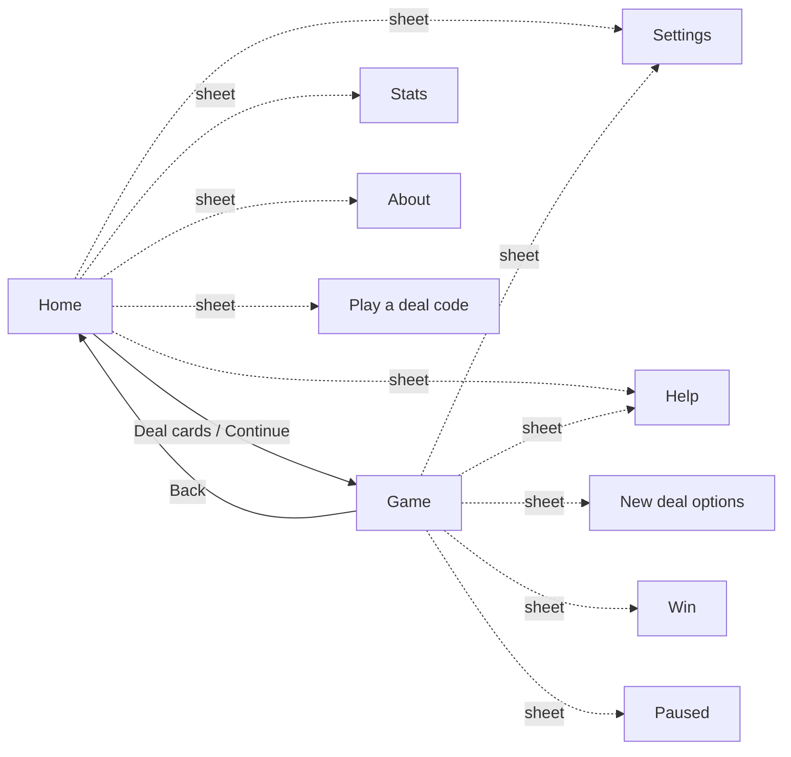

# Klondike Solitaire — Product Specification (v1)

> **Role of this file.** *What* the app does and *how it behaves* for the player: screens, modes, settings, rules of play and requirements in EARS notation. It deliberately avoids implementation detail; see `phased-design.md` for that. Game rules and numbers are defined in `research.md`, and this file refers to them by section (for example *R§5.1* = `research.md` §5.1). The visual reference is `mockup/klondike-mockup.html` plus `mockup/screens/`.
>
> **Requirement IDs** (`KS-<AREA>-NN`) are stable. Reference them from Speckit specs, tasks and tests.

---

## 1. Product overview

|                |                                                                                                                                                                                                                                                            |
| -------------- | ---------------------------------------------------------------------------------------------------------------------------------------------------------------------------------------------------------------------------------------------------------- |
| **What**       | A calm, retro-styled Klondike Solitaire you play in the browser.                                                                                                                                                                                           |
| **Who**        | Casual players on phones (touch) and computers (mouse and keyboard).                                                                                                                                                                                       |
| **Where**      | Any modern browser. It can be installed as an app and works fully offline after the first visit.                                                                                                                                                           |
| **Principles** | (1) Every Draw 1 deal can be won. (2) Every input method works everywhere: tap, drag, keyboard. (3) Calm and readable: soft blue pastel palette, pixel typography for headings and numbers only. (4) No accounts, no ads, no network needed while playing. |
| **Family**     | A sibling of the author's *Minesweeper* app: same structure of screens and sheets, same LCD counters and pixel wordmark, but its own icy-blue palette and a card-table identity.                                                                           |

### 1.1 In scope for v1
Four game modes (Draw 1, Draw 3, Vegas, Daily deal); winnable-only Draw 1 deals; tap, drag, double-click and full keyboard play; unlimited undo/redo; hints; auto-finish; optional safe auto-moves; Standard and Vegas scoring; timer with automatic pause; statistics; restart and replay by deal code; save and resume; light, dark and system themes; night cards; four-colour deck; card-back choice; stock-side option; animations with reduced-motion support; English and Ukrainian (more languages later); layouts fitted to the phone and foldable device matrix (§8.5); installable offline PWA.

### 1.2 Out of scope for v1 (future ideas)
Accounts, leaderboards or any backend; cumulative Vegas bankroll; "strict Vegas" (no undo); winnable verification of Draw 3 deals (planned as an optional phase); sound and haptics; other solitaire games (Spider, FreeCell); daily-deal calendar and archive; native store apps.

---

## 2. Game modes

| Mode           | Draw    | Scoring               | Passes through stock                            | Deals                                                     | Notes                                          |
| -------------- | ------- | --------------------- | ----------------------------------------------- | --------------------------------------------------------- | ---------------------------------------------- |
| **Draw 1**     | 1 card  | Standard              | Unlimited (−100 per recycle)                    | Winnable-only (default) or random                         | The default mode.                              |
| **Draw 3**     | 3 cards | Standard              | Unlimited (−20 per recycle from the 3rd onward) | Random (the "Random deal" chip is shown)                  | Harder: only every third card is playable.     |
| **Vegas**      | 3 cards | Vegas, starts at −$52 | Max 3 passes                                    | Random                                                    | The bankroll is per game in v1.                |
| **Daily deal** | 1 card  | Standard              | Unlimited                                       | Always winnable; the same for everyone on a given UTC day | Replaying on the same day gives the same deal. |

Rules of play: *R§2*. Scoring: *R§5*. Deal generation and daily seeding: *R§3*, *R§4*.

---

## 3. Screens and views

Sheets are modal dialogs over the current screen. Only one is open at a time; Escape or tapping the backdrop closes it, except for Win.

### 3.1 Home
Reference: `screens/01-home-light-desktop.png`, `screens/02-home-dark-phone.png`.

| Element                 | Behaviour                                                                                                                                                                                                                                                                                                       |
| ----------------------- | --------------------------------------------------------------------------------------------------------------------------------------------------------------------------------------------------------------------------------------------------------------------------------------------------------------- |
| **Top bar**             | Pixel logo mark + "Solitaire"; theme toggle (moon/sun); Settings.                                                                                                                                                                                                                                               |
| **Hero panel**          | A small table-coloured panel: badge "Klondike · Draw 1 & 3", pixel wordmark **SOLITAIRE** with a stepped two-colour shadow, one-paragraph pitch, a slowly floating fan of cards (still when reduced motion is on), and a dithered strip along the bottom edge. Side by side on wide screens, stacked on phones. |
| **Choose a game**       | Four tiles styled as playing cards, with a corner index and suit: `1♠` Draw 1, `3♥` Draw 3, `$♦` Vegas, `<day>♣` Daily deal. Each shows its rules line and the player's best time (or "No record yet"). One is selected (it lifts, gets a sky-blue ring and a pixel corner mark); the choice is remembered.     |
| **Winnable deals only** | A switch with a one-line caption. Disabled for Draw 3 and Vegas, with the caption explaining why.                                                                                                                                                                                                               |
| **Actions**             | **Deal cards** (primary, pixel label, 8-bit press effect); **Continue game** (shown only if a resumable game exists); **How to play**.                                                                                                                                                                          |
| **Record strip**        | An LCD strip with Played, Won, Win rate and Streak across all modes.                                                                                                                                                                                                                                            |
| **Links**               | Statistics · Settings · Play a deal code · About. **Install app** appears when the browser supports installation.                                                                                                                                                                                               |
| **Footer**              | Build stamp in pixel type.                                                                                                                                                                                                                                                                                      |

### 3.2 Game
Reference: `screens/03…09`.

| Element       | Behaviour                                                                                                                                                                                                                                                                                   |
| ------------- | ------------------------------------------------------------------------------------------------------------------------------------------------------------------------------------------------------------------------------------------------------------------------------------------- |
| **Top bar**   | Back to Home; **mode chip** (for example "DRAW 1 · STANDARD", "VEGAS", "DAILY · SEP 19"); **deal chip**: "✓ Winnable" (plus "· N shuffles" when more than one was needed) or "🎲 Random deal"; theme toggle; Settings.                                                                       |
| **HUD**       | LCD counters: **Score** (or **Bank** in Vegas, shown as `$47` / `-$52`), **Moves** and **Time** (tap to pause); centre **New deal** button. On very narrow phones the Moves counter may be hidden.                                                                                          |
| **Hint line** | A short text describing the current tap mode, plus keyboard chips on devices with a fine pointer. Temporarily replaced by the hint text when a hint is shown.                                                                                                                               |
| **Board**     | Table-coloured panel with a subtle dot texture. Top row: stock (with a remaining-cards badge), waste, a gap, then 4 foundations (♥ ♣ ♦ ♠) showing faint "A + suit" placeholders. Below: 7 tableau columns with faint "K" placeholders when empty. Mirrored when "stock on the right" is on. |
| **Toolbar**   | Undo, Redo, Hint, Finish. Disabled states are visible; Finish is highlighted when available.                                                                                                                                                                                                |
| **Footer**    | Deal code (for example `Deal 1-K7Q29XD`, tap to copy) and the build stamp.                                                                                                                                                                                                                  |

### 3.3 Sheets
| Sheet                | Content                                                                                                                                                                                                                                                                   |
| -------------------- | ------------------------------------------------------------------------------------------------------------------------------------------------------------------------------------------------------------------------------------------------------------------------- |
| **Settings**         | All settings in §6, grouped: Appearance (theme, night cards, four-colour deck, card back), Play (tap behaviour, highlight legal moves, auto-move safe cards, stock side, animations), Language, Data (reset statistics, reset all local data). Changes apply immediately. |
| **How to play**      | Four rule cards (Foundations A→K, build down in alternating colours, only Kings to empty columns, Draw 1 vs Draw 3), a controls table (tap, drag, double-click, Space, Ctrl+Z/Y, H, A, N, P, Esc) and a short scoring summary. Reference: `screens/11`.                   |
| **Statistics**       | A table per mode (Played, Won, Win rate, Best time, Best score/bank, Best streak), plus the Daily streak. Reset (with confirmation).                                                                                                                                      |
| **New deal options** | Shown when New deal is pressed during a started, unfinished game: **Restart this deal** · **New deal** · Cancel. It warns that leaving breaks the current streak. When no move has been made yet, a new deal starts immediately.                                          |
| **Paused**           | Hides the board (so a paused game can't be studied), shows the time, and has a Resume button.                                                                                                                                                                             |
| **Win**              | Pixel "You win!", a one-line summary (including the time bonus in Standard), a "New best time" badge when relevant, Score, Time and Moves tiles, **Menu** and **Deal again**. It appears over the still-running cascade. Reference: `screens/12`, `screens/13`.           |
| **Dead end**         | A non-blocking notice: "No moves left. Undo a few steps or deal again."                                                                                                                                                                                                   |
| **Play a deal code** | Enter a code, then Play. Invalid codes show an inline error.                                                                                                                                                                                                              |
| **About**            | App name, version and build stamp, source link, licence, a line on privacy (everything stays on this device).                                                                                                                                                             |
| **Update ready**     | A notice when a new version is installed in the background: **Update** / Later.                                                                                                                                                                                           |

---

## 4. Play behaviour

### 4.1 Dealing
- A new game shuffles and deals per *R§2.1*.
- In winnable-only modes, deals are checked by the solver before they're shown (*R§4*). If checking takes noticeably long, a small "Shuffling a winnable deal…" overlay with an attempt counter appears.
- Cards animate from the stock into the tableau one by one, and the last card of each column flips face-up.
- Every deal has a **deal code**. The same code (and mode) always produces the same deal.

### 4.2 Moving cards: four equivalent ways
1. **Smart tap** (default): tap or click a face-up card (and everything on it) and it goes to its best legal place (*R§6.5*). If there's none, the card shakes.
2. **Select & place** (setting): the first tap picks up the card or run (highlighted); a tap on a legal pile places it; a tap elsewhere changes or clears the selection. Double-tap/double-click sends a single card to its foundation.
3. **Drag**: press and move past a small threshold to pick up the card or run; it follows the pointer; legal drop targets are highlighted and the hovered one is emphasised. Releasing over a legal target moves the cards; otherwise they glide back.
4. **Keyboard**: see §4.8.

Tapping the stock draws cards; tapping the empty stock turns the waste over (subject to pass limits).

### 4.3 Automatic behaviour
- A face-down card that becomes the top of a column flips over automatically.
- **Auto-move safe cards** (setting, off by default): after each move, safe cards (*R§6.2*) travel to the foundations one after another.
- **Finish** becomes available when a finish plan completes under the ordinary rules (*R§6.3*), which requires every tableau card to be face up; it plays every remaining card home in a quick sequence. Its draws and recycles are scored, counted and pass-limited like the player's; there is no pass-penalty exemption.

### 4.4 Undo and redo
- Unlimited undo back to the start of the deal; redo until a new move is made.
- Automatic follow-up moves (flip, safe auto-moves) are undone together with the move that caused them.
- Standard scoring charges −2 per undo; Vegas undo just restores the previous bankroll.
- Undo is unavailable after a win.

### 4.5 Hints
- Hint highlights the card(s) to move and where they go, and explains it in the hint line for about 2 seconds.
- In Draw 1 modes the hint comes from the solver's winning line when one can be found quickly; otherwise it uses the heuristic in *R§6.1*.
- If the best move is to draw, the stock pulses. If nothing helps, the dead-end notice appears.

### 4.6 Dead end and win
- When no productive move is left (*R§6.4*), the dead-end notice appears once per position. The game stays open for Undo.
- When the last card reaches its foundation: the timer stops, the time bonus is added (Standard), statistics are updated, the cascade plays (skipped with reduced motion) and the Win sheet appears.

### 4.7 Timer and pause
- The timer starts with the first move and shows `m:ss` (`h:mm:ss` from one hour).
- It pauses automatically while on Home, while any sheet is open, and while the tab or app is hidden. It resumes when play resumes.
- Tapping the Time counter, or pressing P, pauses explicitly and shows the Paused sheet.

### 4.8 Keyboard
| Key                                   | Action                                                                            |
| ------------------------------------- | --------------------------------------------------------------------------------- |
| Tab / Shift+Tab                       | Move between piles (stock, waste, foundations, columns) and focusable cards       |
| Arrow keys                            | Move focus between piles (left/right) and between cards within a column (up/down) |
| Enter / Space on a card               | Same as a tap (smart move, or pick up/place)                                      |
| Space (nothing focused)               | Draw from the stock                                                               |
| Ctrl/⌘+Z · Ctrl/⌘+Y or Ctrl/⌘+Shift+Z | Undo · Redo                                                                       |
| H · A · N · P                         | Hint · Finish · New deal · Pause                                                  |
| Esc                                   | Cancel selection or drag; close a sheet                                           |

---

## 5. Scoring and statistics
- **Standard** and **Vegas** scoring exactly as in *R§5.1–5.2*, plus the project's undo decisions (§4.4).
- Standard scores never go below 0.
- The stored score is the move score. The displayed score is derived: the move score minus the time penalty (floored at 0 under Standard only), plus the win bonus once the game is won. The time penalty is a total computed from elapsed *unpaused* play time (Standard: 2 × ⌊seconds ÷ 10⌋); it is never deducted from the stored score as time passes.
- **Statistics** per mode as in *R§7*. A game counts as played at the first move. Starting a different deal while a game is started and unfinished breaks that mode's streak; **Restart this deal** does too.
- **Daily**: a completed day is recorded once; the daily streak counts consecutive UTC days completed.
- Records: best time (lowest), best score / best bank (highest), best streak.

---

## 6. Settings

| Setting               | Options                                | Default                                             | Effect                                                                                       |
| --------------------- | -------------------------------------- | --------------------------------------------------- | -------------------------------------------------------------------------------------------- |
| Theme                 | Light · Dark · System                  | System                                              | Colour scheme; System follows the device live. Also toggled by the top-bar button.           |
| Night cards           | On · Off                               | Off                                                 | Navy card faces with light ink; pale card backs.                                             |
| Four-colour deck      | On · Off                               | Off                                                 | Diamonds blue, clubs green (suits distinguishable at a glance).                              |
| Card back             | Harbour blue · Deep navy · Sky · Coral | Harbour blue                                        | Pattern colour of face-down cards.                                                           |
| Tap a card to…        | Smart move · Select & place            | Smart move                                          | See §4.2. Drag works in both.                                                                |
| Highlight legal moves | On · Off                               | On                                                  | Show all legal targets while a card is picked up.                                            |
| Auto-move safe cards  | On · Off                               | Off                                                 | See §4.3.                                                                                    |
| Stock on the right    | On · Off                               | Off                                                 | Mirrors the top row for right-thumb play.                                                    |
| Animations            | On · Off                               | On                                                  | Deal, move, flip and cascade animations; forced off when the system asks for reduced motion. |
| Language              | English · Українська (more later)      | First supported browser language, otherwise English | All text.                                                                                    |
| Winnable deals only   | On · Off (on Home)                     | On                                                  | Applies to Draw 1; Daily is always winnable.                                                 |
| Selected mode         | Draw 1 · Draw 3 · Vegas · Daily        | Draw 1                                              | Remembered Home selection.                                                                   |
| Reset statistics      | action                                 | —                                                   | After confirmation, clears all statistics.                                                   |
| Reset all local data  | action                                 | —                                                   | After confirmation, clears settings, statistics and the saved game.                          |

Changing a setting never alters the rules of a game in progress. The mode is fixed when a deal starts.

---

## 7. Saving and resuming
- Settings, statistics and the unfinished game (including its undo history, up to a limit) are kept **only on this device**.
- Leaving, reloading or closing the app keeps an unfinished game; **Continue game** on Home restores it exactly, including time, score, moves and deal code. Finished games aren't resumable.
- If stored data is missing, damaged or from an unknown version, the app starts with defaults and shows a short notice. It never crashes and never deletes data it couldn't read.
- If the device refuses to save (private mode or full storage), play continues and a non-blocking notice explains that progress won't be kept.

---

## 8. Look and feel

### 8.1 Palette (from the chosen "icy, heroic, crisp" + "bold, clean" references)
| Role                    | Light                                                                | Dark                     |
| ----------------------- | -------------------------------------------------------------------- | ------------------------ |
| Page background         | #E8F0F5                                                              | #0B2545                  |
| Surface / raised        | #F8FBFB / #EEF4ED                                                    | #13315C / #1A3A66        |
| Table                   | #D4E4EE (dot texture)                                                | #102C52                  |
| Text / muted            | #0B2545 / #4F6A88                                                    | #EEF4ED / #8DA9C4        |
| Primary action          | #457B9D                                                              | #5BC0EB                  |
| Accent / highlight      | #A8DADC, #5BC0EB                                                     | #1D3F70, #A8DADC         |
| LCD panel / digits      | #0B2545; score #F4A7AD, moves #A8DADC, time #5BC0EB                  | #06172D; same digits     |
| Hint (only warm colour) | #F2B25C                                                              | #F2C078                  |
| Card face / edge        | #FBFDFB / #C8D7E3                                                    | dimmed #D2DDE5 / #06172D |
| Suit ink red / black    | #D44B56 / #1D3557 (navy)                                             | #CC4450 / #13315C        |
| Four-colour ♦ / ♣       | #2F93BF / #3A8F7C                                                    | #2A86B0 / #2F7D6B        |
| Night cards             | face #1C3D68, edge #36608F, ink #DCE8EF / red #F28B93, backs #8DA9C4 | same                     |
| Card backs              | #457B9D · #13315C · #5BC0EB · #D9555F, with a lighter checker        | same                     |

### 8.2 Typography and shapes
- **Inter** for all running text and controls. **Press Start 2P** for the wordmark, card indices, LCD digits, chips and tiny labels.
- Rounded surfaces (9 / 14 / 20 px radii); cards have a rank + suit corner index and a large centre pip. J, Q and K show the letter in a pixel-drawn box. A mirrored bottom corner appears when the card is large enough.
- Card backs use a two-tone pixel checker with a thin rim.

### 8.3 Motion
- Cards glide about 240 ms to new places; flips are about 300 ms 3D turns.
- Deal: a staggered sequence from the stock, about 1.3 s in total.
- A card picked up for dragging lifts with a deeper shadow; an illegal smart-tap shakes.
- The hint pulses twice; the win cascade bounces cards off the bottom edge.
- All motion is disabled by the Animations setting or the system's reduced-motion preference; state changes then apply instantly.

### 8.4 Layout
- **The Game screen is one screen: it never scrolls.** The table scales so every pile fits. Columns compress vertically as they grow, squeezing face-down cards before face-up ones (*R§10*).
- **Three layouts, chosen automatically** (*R§13.3*):

| Layout         | When                                                                                                                      | What changes                                                                                                                                                            |
| -------------- | ------------------------------------------------------------------------------------------------------------------------- | ----------------------------------------------------------------------------------------------------------------------------------------------------------------------- |
| **Stacked**    | Portrait phones, foldables, tablets, desktop                                                                              | Top bar, HUD, table (stock, waste and foundations in the top row), toolbar at the bottom.                                                                               |
| **Side rails** | Landscape with a short screen (height ≤ 720 px): phones on their side, unfolded foldables, short laptop windows           | No top bar or hint line. A left rail holds back, settings, score, moves, new deal and time; a right rail holds Undo, Redo, Hint and Finish. The table fills the middle. |
| **Wide table** | Any board where it gives long columns thicker finger strips (in practice: landscape phones and very short portrait views) | Stock and waste move to a left column, the four foundations stack in a right column, and the tableau uses the full height.                                              |

- **Home on phones:** a compact hero and shorter mode tiles. **Deal cards / Continue / How to play** sit in a bar pinned to the bottom, so the main action is always visible even if the rest of Home scrolls.
- **Notches, rounded corners, the home indicator and punch-hole cameras** are respected in every orientation (safe areas). Content never sits under them.
- **Folding or unfolding, rotating, or showing/hiding the browser bars** re-lays the table immediately. The game, timer and selection are kept; a drag in progress is cancelled and its cards glide back.

### 8.5 Device matrix
The app must fit the devices below, in **portrait and landscape**, both **in the browser** (address bars take some height) and **installed** (full screen). Exact viewport sizes, sources and the measured results are in *R§13*.

| Group          | Devices                                                                                                        |
| -------------- | -------------------------------------------------------------------------------------------------------------- |
| iPhone         | 14 Pro, 14 Pro Max, 17 Pro, 17 Pro Max                                                                         |
| Samsung Galaxy | S25, S25+, S25 Ultra (both FHD+ and QHD+ screen-resolution settings)                                           |
| Foldables      | iPhone Duo (outer and inner screens), Galaxy Z Fold 8 (cover and main), Galaxy Z Fold 8 Ultra (cover and main) |
| Baseline       | Any viewport from 320×480 up to 2560×1440; desktop 1280×720 and larger                                         |

New devices are added to *R§13.1* and to the automated fit test. The rules in §8.4 are written so that unknown sizes also fit.

---

## 9. Requirements (EARS)

Legend: **Ubiquitous** "The system shall…" · **Event** "WHEN … the system shall…" · **State** "WHILE …" · **Unwanted** "IF … THEN …" · **Optional** "WHERE …".

### 9.1 General (GEN)
- **KS-GEN-01** The system shall run entirely in the browser with no server, account or network request required for play.
- **KS-GEN-02** The system shall provide two screens (Home and Game) and the sheets listed in §3.3, with at most one sheet open at a time.
- **KS-GEN-03** The system shall render correctly on every viewport from 320×480 to 2560×1440 in portrait and landscape without horizontal page scrolling.
- **KS-GEN-05** WHILE the Game screen is shown, the system shall fit all game controls and all cards, including a column of 6 face-down and 13 face-up cards, within the viewport without page scrolling, for every device in §8.5 in portrait and landscape, in the browser and installed.
- **KS-GEN-06** WHILE the viewport is in landscape and its height is at most 720 px, the system shall use the side-rails layout (§8.4).
- **KS-GEN-07** WHERE the wide-table layout gives the worst-case column a thicker face-up strip than the stacked layout, and the stacked layout's strip is below 14 px on touch screens or 9 px with a mouse, the system shall use the wide-table layout.
- **KS-GEN-08** WHEN the viewport size changes (rotation, folding or unfolding, browser bars appearing), the system shall re-lay out the table within one animation frame, keep the game state, and cancel any drag in progress with the cards returning to their origin.
- **KS-GEN-09** WHILE Home is shown on a phone or any viewport at most 720 px tall, the system shall keep Deal cards (and Continue game, when present) visible without scrolling.
- **KS-GEN-10** The system shall keep all content and controls clear of device safe areas (notch, rounded corners, home indicator) in every orientation.
- **KS-GEN-04** WHEN the player presses Back on the Game screen, the system shall return to Home and keep the unfinished game resumable.

### 9.2 Deals (DEAL)
- **KS-DEAL-01** WHEN a new game starts, the system shall produce the deal by an unbiased shuffle and the row-by-row deal of *R§2.1*.
- **KS-DEAL-02** The system shall derive every deal from a seed and show its deal code, such that the same code and mode always reproduce the identical deal.
- **KS-DEAL-03** WHILE "Winnable deals only" is on and the mode draws 1 card, the system shall present only deals that the solver has proven winnable.
- **KS-DEAL-04** WHEN proving a deal takes longer than 160 ms, the system shall show a "Shuffling a winnable deal…" overlay with an attempt counter until a deal is ready.
- **KS-DEAL-05** IF no deal is proven winnable within the attempt limit (40), THEN the system shall present the last deal and mark it "Random deal".
- **KS-DEAL-06** The system shall show a deal chip stating "Winnable" (with the shuffle count when above 1) or "Random deal".
- **KS-DEAL-07** WHEN the Daily deal is started, the system shall use the deal selected for the current UTC date, always verified as winnable and independent of the player's settings.
- **KS-DEAL-08** WHEN the player chooses Restart this deal, the system shall re-deal the same deal code in the same mode with score, moves, time and history reset.
- **KS-DEAL-09** WHEN the player enters a valid deal code, the system shall start that deal; IF the code is invalid, THEN the system shall show an inline error and not start a game.
- **KS-DEAL-10** The system shall never block input for more than 100 ms while searching for a winnable deal.

### 9.3 Rules and moves (MOVE)
- **KS-MOVE-01** The system shall allow exactly the moves in *R§2.2* and reject all others without changing state.
- **KS-MOVE-02** WHEN a tableau column's top card becomes face-down after a move, the system shall turn it face-up as part of the same move.
- **KS-MOVE-03** WHEN the player activates the stock while it has cards, the system shall move the mode's draw count (or the remainder) to the waste.
- **KS-MOVE-04** WHEN the player activates an empty stock and the waste has cards, the system shall turn the waste back into the stock if the pass limit allows.
- **KS-MOVE-05** IF a recycle would exceed the Vegas pass limit, THEN the system shall refuse it and show "No redeals left".
- **KS-MOVE-06** WHILE the mode draws 3 cards, the system shall display up to three waste cards fanned, with only the top one playable.
- **KS-MOVE-07** WHEN all 52 cards are on the foundations, the system shall end the game as won.

### 9.4 Input (INP)
- **KS-INP-01** WHILE the tap setting is Smart move, WHEN the player taps a movable card, the system shall move it (and the cards on it) to the best legal target per *R§6.5*, or shake it if none exists.
- **KS-INP-02** WHILE the tap setting is Select & place, WHEN the player taps a movable card, the system shall select it; WHEN the player then taps a legal target, the system shall move the selection there.
- **KS-INP-03** WHEN the player double-taps or double-clicks a single movable card that fits its foundation, the system shall move it there.
- **KS-INP-04** WHEN the pointer moves more than the drag threshold (5 px mouse, 9 px touch or pen) after pressing a movable card, the system shall start a drag of that card and all cards on it.
- **KS-INP-05** WHILE dragging, the system shall keep the dragged cards under the pointer and emphasise the legal target with the largest overlap.
- **KS-INP-06** WHEN a drag ends over a legal target, the system shall perform the move; otherwise the system shall return the cards to their origin with animation.
- **KS-INP-07** IF a drag has started, THEN the system shall not treat its release as a tap.
- **KS-INP-08** The system shall support all actions in §4.8 from the keyboard alone.
- **KS-INP-09** WHILE a game is won, a sheet is open, or the win animation is running, the system shall ignore board input.
- **KS-INP-10** The system shall not scroll or zoom the page in response to gestures that start on the board.

### 9.5 Assistance (AST)
- **KS-AST-01** WHILE Highlight legal moves is on and cards are selected or dragged, the system shall mark every legal target.
- **KS-AST-02** WHEN the player requests a hint, the system shall highlight the suggested source and target (or the stock) for about 2 s and describe it in the hint line.
- **KS-AST-03** WHERE a solver line is available for the current Draw 1 position within the hint budget, the system shall base the hint on that line's first move.
- **KS-AST-04** WHILE Auto-move safe cards is on, WHEN a move completes, the system shall move safe cards (*R§6.2*) to the foundations one by one.
- **KS-AST-05** WHILE the game isn't won and a finish plan exists (every tableau card is face-up and the plan completes under the ordinary rules), the system shall enable Finish; WHEN Finish is used, the system shall play all remaining cards to the foundations, charging and pass-limiting its draws and recycles like the player's.
- **KS-AST-06** WHEN no productive move remains (*R§6.4*), the system shall show the dead-end notice once for that position.
- **KS-AST-07** WHEN the player undoes, the system shall restore the exact state before the last player move, including automatic follow-up moves; WHEN the player redoes, the system shall re-apply it.
- **KS-AST-08** WHEN the player makes a new move after undoing, the system shall discard the redo history.

### 9.6 Scoring and time (SCO)
- **KS-SCO-01** WHILE the mode uses Standard scoring, the system shall apply the points of *R§5.1*, never letting the score drop below 0.
- **KS-SCO-02** WHILE the mode uses Vegas scoring, the system shall start at −$52, add $5 per card to a foundation, subtract $5 per card leaving one, and display the value as money.
- **KS-SCO-03** WHEN the player undoes in Standard scoring, the system shall subtract 2 points from the restored score.
- **KS-SCO-04** WHEN a Standard game is won after more than 30 s, the system shall add a bonus of floor(700,000 ÷ seconds).
- **KS-SCO-05** The system shall start the timer on the first move and count only unpaused play time.
- **KS-SCO-06** WHILE the Game screen is hidden, a sheet is open or the document is hidden, the system shall pause the timer and the time penalty.
- **KS-SCO-07** WHEN the player activates the time counter or presses P, the system shall pause and show the Paused sheet with the board hidden.

### 9.7 Statistics (STA)
- **KS-STA-01** WHEN the first move of a game is made, the system shall count the game as played for its mode.
- **KS-STA-02** WHEN a game is won, the system shall update won count, streak, best streak, best time and best score for its mode.
- **KS-STA-03** WHEN a started, unfinished game is replaced (New deal, Restart, or a new game from Home), the system shall reset that mode's current streak to 0.
- **KS-STA-04** WHEN the Daily deal is won, the system shall record the UTC date as completed and update the daily streak.
- **KS-STA-05** WHEN the player confirms Reset statistics, the system shall clear all statistics.

### 9.8 Settings and appearance (SET)
- **KS-SET-01** WHEN any setting changes, the system shall apply it immediately without a reload and remember it.
- **KS-SET-02** WHERE Theme is System, the system shall follow the device colour scheme and update when it changes.
- **KS-SET-03** The system shall provide the light, dark and night-card palettes of §8.1 with text contrast of at least 4.5:1.
- **KS-SET-04** WHILE reduced motion is requested by the system or Animations is off, the system shall apply state changes without animation and skip the cascade.
- **KS-SET-05** WHILE Stock on the right is on, the system shall mirror the top row.
- **KS-SET-06** The system shall not change the rules of a game in progress when settings change.

### 9.9 Persistence (PER)
- **KS-PER-01** The system shall store settings, statistics and the unfinished game (with up to 200 undo steps) on the device.
- **KS-PER-02** WHEN the app is reopened with an unfinished game stored, the system shall offer Continue game and restore that game exactly.
- **KS-PER-03** IF stored data is missing, unreadable or from an unknown version, THEN the system shall start with defaults, keep the unreadable data untouched, and show a non-blocking notice.
- **KS-PER-04** IF saving fails, THEN the system shall keep the current game playable and show a non-blocking notice.
- **KS-PER-05** WHEN the player confirms Reset all local data, the system shall clear stored data and restore defaults.

### 9.10 Accessibility (A11Y)
- **KS-A11Y-01** The system shall give every card an accessible name ("Queen of Spades", "Face-down card") and every pile a name ("Column 3, 5 cards", "Stock, 18 cards").
- **KS-A11Y-02** WHEN a move, draw, undo, hint or win happens, the system shall announce it through a polite live region.
- **KS-A11Y-03** The system shall show a visible focus indicator on every focusable element and trap focus inside open sheets, returning focus afterwards.
- **KS-A11Y-04** WHERE the pointer is coarse, the system shall keep interactive targets outside the table at least 44×44 px, give each exposed face-up card in a column a strip of at least 14 px on every §8.5 device (installed, both orientations; the shortest browser landscape views are exempt), and treat a tap anywhere on a card's exposed strip as a tap on that card.
- **KS-A11Y-05** The system shall not rely on colour alone to distinguish suits.

### 9.11 Offline, install and updates (PWA)
- **KS-PWA-01** WHEN the app has been opened once online, the system shall load and be fully playable offline, including a cold start.
- **KS-PWA-02** WHERE the browser supports installation, the system shall offer Install app on Home.
- **KS-PWA-03** WHEN a new version is available, the system shall show an Update notice and activate the update only after the player chooses Update and the current game has been saved.
- **KS-PWA-04** The system shall load no fonts, images or scripts from third-party hosts.

### 9.12 Localisation (I18N)
- **KS-I18N-01** The system shall provide all visible text in English and Ukrainian and switch language immediately.
- **KS-I18N-02** WHEN the app starts for the first time, the system shall choose the first supported language from the browser's preferred languages, otherwise English.
- **KS-I18N-03** The system shall support adding a language by adding one translation catalog and registering it, without changes to screens or components.
- **KS-I18N-04** The system shall display every screen at every device-matrix size without clipped or overlapping text when strings are up to 30% longer than English (Ukrainian runs about 10–25% longer).

### 9.13 Performance (PERF)
- **KS-PERF-01** The system shall keep dragging and card animations at 60 fps on a mid-range phone.
- **KS-PERF-02** The system shall present a winnable Draw 1 deal within 300 ms at the median and 1.5 s at the 95th percentile on a mid-range phone.
- **KS-PERF-03** The system shall reach an interactive Home screen within 2 s on a mid-range phone over a fast 3G connection on first load.

---

## 10. Key acceptance scenarios
1. **First launch, full game:** Home → Draw 1 → Deal cards. The chip shows Winnable; the player wins by tapping only. Win sheet; statistics show 1 played, 1 won, streak 1.
2. **Drag a run:** drag a 3-card run onto a legal column; it lands and the uncovered card flips (+5). Undo returns everything, including the face-down card, and the score shows the −2.
3. **Illegal drop:** drag a red 7 onto a red 8; the cards glide back and nothing changes.
4. **Draw 3 fan and recycle:** three waste cards show fanned; only the top one moves. On the 3rd recycle −20 applies.
5. **Vegas limit:** after 3 passes, tapping the empty stock shows "No redeals left".
6. **Daily sameness:** two browsers set to different time zones on the same UTC day get the same daily deal code.
7. **Restart deal:** mid-game, New deal → Restart this deal gives the identical layout; the streak is reset.
8. **Resume:** make 10 moves, reload. Continue game restores cards, score, moves, time and undo.
9. **Offline cold start:** after one online visit, go offline and open a fresh tab; the app loads and deals.
10. **Keyboard-only win:** a full game using Tab, Arrows, Enter, Space and A.
11. **Reduced motion:** with the OS setting on, the deal is instant and there is no cascade; the Win sheet shows directly.
12. **Dark + night cards:** all text readable (4.5:1); face-down and face-up cards clearly distinct.
13. **Rotate and fold:** on an iPhone Duo or Z Fold 8, start a game on the cover screen, unfold mid-game, rotate, and fold again. The game carries on unchanged, the layout switches (stacked → side rails → stacked) and nothing ever scrolls.
14. **Landscape phone:** on an iPhone 17 Pro in landscape in Safari, the wide-table layout appears. A 13-card run can be picked up by its first card with a finger.

---

## 11. Open points (TODO: confirm)
- Whether Daily deal statistics should also store a per-day history (calendar) in v1 or later.
- Ukrainian texts: machine-drafted, then reviewed by the author.
